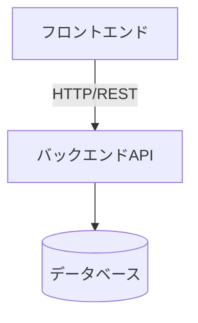

# ArchitectureHandbook.md

このドキュメントは、P022フェーズで作成・更新する。目的は、後続のAgent(Executor・Reviewer Loop・Refactor)が `docs/P001-requirement.md` 〜 `docs/P009-acceptance-direction.md` を毎回読み直さなくても、アプリケーションの技術的側面を短時間で把握できるようにすることである。

* 詳細な仕様そのものはここに書かない。詳細は `docs/P002-frontend-spec.md` `docs/P003-backend-spec.md` などの原本を参照させ、ここには「どこに何が書いてあるか」と「実装・運用にあたって知っておくべき技術的な要点」だけをまとめる。
* 仕様が変わるたびに全面書き直しするのではなく、差分だけを更新する。矛盾が出た場合は原本(`docs/P00N-*.md`)を正とする。
* 記載内容が古くなっていないかは、P020(実装構造生成/修正)・P021(ADR整理)と合わせて確認する。

## 1. アプリケーション概要

* アプリケーション名:
* 一言で言うと何のアプリか:
* 参照元: `docs/P001-requirement.md`

## 2. 全体構成図

* 上記は例。実際の構成(クライアント/サーバ構成か、単一アプリか、外部サービス連携があるか)に合わせて描き直す。

## 3. 技術スタック

| レイヤ | 技術 | バージョン | 選定理由の参照先 |
| --- | --- | --- | --- |
| フロントエンド | | | ADR-NNN |
| バックエンド | | | ADR-NNN |
| データベース | | | ADR-NNN |
| 認証 | | | ADR-NNN |
| インフラ/デプロイ | | | ADR-NNN |

* 上記5行は例。実際のレイヤ構成に合わせて行を追加・削除してよい(例: キャッシュ層やメッセージキューがあれば行を足す、認証を別レイヤとして持たない構成なら行を削る)。
* 「選定理由の参照先」は1つのADRとは限らない。複数のADRにまたがる場合はカンマ区切りで列挙してよい(例: `ADR-002, ADR-004`)。1つのADRにまとめるべきかどうかは `SKILL-P021-adr.md` の粒度基準に従う — この表の行数を埋めるためにADRを不必要に粗くまとめない。
* 標準ライブラリのみを採用しバージョンの概念が無い場合(例: 言語処理系に同梱、外部依存なし)は、「バージョン」列に空欄ではなく「言語処理系に同梱」等の理由を書く。

## 4. ディレクトリ構成の方針

* コード格納先の命名規則(例: 単一アプリなら `app/`、クライアント・サーバ型なら `client/` `server/`)
* 各ソースツリー配下の `INDEX.md` の位置と役割 (`SKILL.md` の「INDEX形式について」を参照)
* ビルドツール(例: Java=maven、Python=uv、React=npm、Angular=ng)

## 5. データモデルの要点

* ER図または主要テーブルの一覧(詳細は `docs/P002-frontend-spec.md` `docs/P003-backend-spec.md` の該当箇所を参照)
* 状態を持つ場合のスコープと実現方法(メモリ/KVS/RDBなど)

## 6. API/画面構成の要点

* 画面一覧・API一覧の要約と、詳細仕様への参照リンク
* P002/P003の役割分担(外部契約 vs 内部実現)で相互参照が必要な箇所があれば、その一覧

## 7. 実装・テストの単位

* スプリント構成の概要(詳細は `docs/P005-impl-plan.md` を参照)
* テストレベルの方針(単体/結合/受け入れ)の要約(詳細は `docs/P006-test-plan.md` を参照)

## 8. 横断的関心事

* 認証・認可の方式
* エラーハンドリングの方針
* ログ出力・監視の方針
* 設定値・環境変数の管理方針

## 9. 既知の制約・技術的負債

* 現時点で仕様上/実装上割り切っている点(意識的に選んだ割り切りには、その理由とともに "★ACCEPTED★" を付す。`SKILL.md` の「各フェーズ共通指示」参照)
* 将来的に見直しが必要な点(あればCRの起票候補として挙げる。実際の起票はP901が `docs/P901-cr-direction/CR-NNN.md` として行う)

## 10. 関連ドキュメントへのリンク

* `docs/P001-requirement.md` 〜 `docs/P009-acceptance-direction.md`
* `docs/ADR.md`
* `{ソースツリー}/INDEX.md` / `./INDEX.md`
