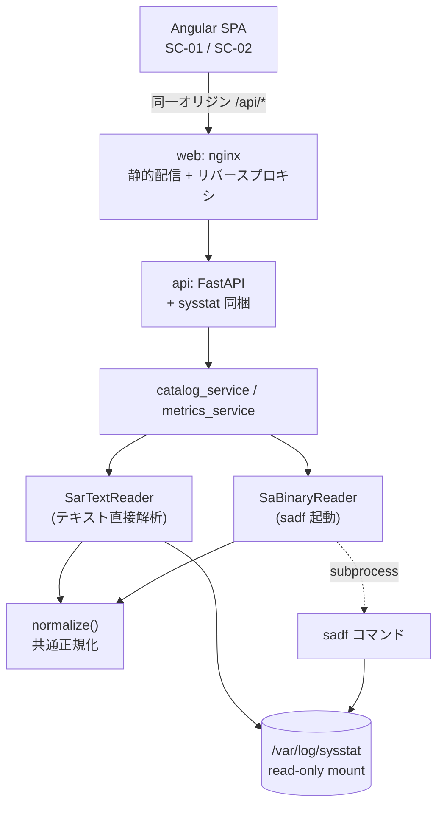

# ArchitectureHandbook.md

後続の Agent (Executor・Reviewer Loop・Refactor) が `docs/P001-requirement.md` 〜 `docs/P009-acceptance-direction.md` を毎回読み直さなくても、技術的側面を短時間で把握できるようにするための要約である。詳細は各原本を参照すること。矛盾が出た場合は原本を正とする。

## 1. アプリケーション概要

* アプリケーション名: **SysstatView**
* 一言で言うと: Linux の sysstat が出力する日次ログ (`saDD` バイナリ / `sarDD` テキスト) を読み、時系列の性能データをブラウザでグラフ表示するビューア。
* 画面は 2 つだけ (ファイル検索・選択 → グラフ表示 → 戻る)。認証なし。書き込みなし。
* 参照元: `docs/P001-requirement.md`

## 2. 全体構成図

* **データベースは無い** (ADR-004)。図に DB が現れないのは意図どおりである。

## 3. 技術スタック

| レイヤ | 技術 | バージョン | 選定理由の参照先 |
| --- | --- | --- | --- |
| フロントエンド | Angular (TypeScript) | 18 系 | ADR-005 |
| グラフ描画 | Chart.js + ng2-charts | Chart.js 4 系 | ADR-005, ADR-006 |
| バックエンド | Python + FastAPI | Python 3.12 / FastAPI 0.115 系 | ADR-005 |
| ASGI サーバ | Uvicorn | 0.32 系 (`--workers 2`) | ADR-008 |
| データストア | **なし** (プロセス内メモリのみ) | 該当なし | ADR-004 |
| 認証 | **なし** | 該当なし | `docs/P001-requirement.md` §10.3 |
| `sa` 読み取り | sysstat (`sadf`) | ディストリ提供版 | ADR-002 |
| `sar` 読み取り | 自前実装 | 言語処理系に同梱 (外部依存なし) | ADR-003 |
| インフラ/デプロイ | Docker Compose + nginx | `nginx:alpine` | ADR-001, ADR-008 |

## 4. ディレクトリ構成の方針

* クライアント・サーバ型のため `backend/` と `frontend/` の 2 ソースツリーに分ける。
* 各ソースツリーの目次は `backend/INDEX.md` / `frontend/INDEX.md` (INDEX形式)。プロジェクト全体の目次は `./INDEX.md` (P301 が作成)。
* ビルドツール: バックエンド = `pip` + `requirements.txt`、フロントエンド = `npm` / Angular CLI。
* 詳細は `docs/P005-impl-plan.md` §1.3。

## 5. データモデルの要点

* **RDB のテーブルは存在しない。**API とアプリ内部で扱う論理エンティティのみ (`docs/P002-frontend-spec.md` §6.2 の ER 図)。
* 主要エンティティ: `LOG_FILE` / `METRIC_GROUP` / `SERIES` / `GROUP_DEF` / `METRIC_DEF` / `CATALOG_ENTRY`。
* 状態のスコープと実現方法 (ADR-004):

| 状態 | スコープ | 実現方法 |
| --- | --- | --- |
| ファイルカタログ (採取日) | プロセス単位 | メモリ辞書。`(パス, mtime, サイズ)` で失効判定 |
| メトリクス解析結果 | プロセス単位 | メモリ LRU (最大 8 ファイル) |
| SC-01 の画面状態 | ブラウザのメモリ | Angular のサービス (`localStorage` 不使用) |

* **不変条件 INV-1〜INV-5** (`docs/P003-backend-spec.md` §4.2) は、正規化層が明示的に検証する。とくに INV-1「`series[].values` の長さ = `timestamps` の長さ」は、両リーダの出力が揃っていることの要である。

## 6. API/画面構成の要点

### 画面

| ID | 画面 | 詳細 |
| --- | --- | --- |
| SC-01 | ログファイル検索・選択 (期間検索 / 1ページ10件 / ラジオ単一選択 / ページリンク) | `docs/P002-frontend-spec.md` §2 |
| SC-02 | グラフ表示 (全メトリクスを見出し・説明付きで描画 / 戻ると状態復元) | `docs/P002-frontend-spec.md` §3 |

### API

| メソッド・パス | 用途 | 詳細 |
| --- | --- | --- |
| `GET /api/health` | 死活確認 + `sadf` の可否 + 読取可能ファイル数 | §5.5 |
| `GET /api/log-files` | 期間・ページ指定の一覧 (`sa` と `sar` の両方) | §5.2 |
| `GET /api/log-files/{fileId}/metrics` | 全メトリクスの時系列 (応答は種別によらず共通) | §5.3 |
| `GET /api/metric-catalog` | 18 グループの表示名・説明・指標定義 | §5.4 |

### P002 / P003 の役割分担で相互参照が必要な箇所

| 項目 | 外部契約 (P002) | 内部実現 (P003) |
| --- | --- | --- |
| エラー応答 | §5.1 (形式・コード表・HTTP) | §11 (例外クラスとの対応、`hint` 生成) |
| `fileId` | §5.2 (不透明な識別子であること) | §5 (生成規則と検証順序) |
| キャッシュ | (露出しない) | §3, §3.1 |

## 7. 実装・テストの単位

### スプリント (詳細: `docs/P005-impl-plan.md`)

`U001` backend-foundation → `U002` sar-text-reader → `U003` sa-binary-reader → `U004` catalog-api → `U005` metrics-api → `U006` frontend-foundation-sc01 → `U007` frontend-graph-sc02 → `U008` containerization

* **`sar` 経路 (U002) を `sa` 経路 (U003) より先に実装する。**この環境で実データによる完全な検証ができる唯一の経路であり、ここで中間表現と正規化を固めれば `sa` 経路はその型に合わせるだけになる。

### テスト方針 (詳細: `docs/P006-test-plan.md`)

| レベル | 担当フェーズ | 重点 |
| --- | --- | --- |
| 単体 | P007 | `sar` テキストの書式耐性 (観点B) |
| 結合 | P008 | **2 経路の結果一致 (観点A)** — 両対応にしたことで生じた最大のリスク |
| システム・受け入れ | P009 | 画面状態の復元 (観点C)、再起動耐性、性能 |

* テストデータは読み取り専用のログファイル。ベースラインは `sysstat-log/var/log/sysstat/` の内容そのもの。復元単位はスイート実行ごと。書き込みを伴うケースは `tmp_path` にコピーして行う。
* **テストスイートは 2 回続けて実行し、同じ結果になることを確認する。**

## 8. 横断的関心事

| 関心事 | 方針 |
| --- | --- |
| 認証・認可 | **行わない。**社内ネットワーク内での利用を前提とし、アクセス制御はネットワーク層に委ねる |
| CORS | **実装しない。**同一オリジン構成で回避する (ADR-001) |
| エラーハンドリング | リーダ層・サービス層は `errors.py` のドメイン例外のみを投げ、`HTTPException` を投げない。ルータ層の単一ハンドラが `{"error": {...}}` へ変換する。`INTERNAL_ERROR` では `detail` に例外の文字列表現を含めない |
| ログ・監視 | 標準出力へ 1 行 1 JSON。`ts`/`level`/`event`/`message` 必須。リクエストログは `method`/`path`/`status`/`durationMs`。集約基盤へは転送しない。`docker compose logs` で参照 |
| 設定値・環境変数 | `SYSSTAT_LOG_DIR` (既定 `/var/log/sysstat`) のみ。テストから差し替えられるよう関数/依存性注入で取得する |
| セキュリティ | パスは受け取らず `fileId` 経由のみ (ADR-007)。`subprocess` は配列引数・`shell=False` (REQ-N-008)。マウントは `:ro` |

## 9. 既知の制約・技術的負債

### 9-1. `sadf -j` の出力フィールド名が実出力で未確認 【要注意・最優先】

* **何を検討したか**: `sa` バイナリの読み取り方法として、自前パースと `sadf` 経由を比較した。
* **なぜそれを採らなかったか**: 自前パースは sysstat のバージョン間非互換により壊れやすいため、`sadf` 経由を採った (ADR-002)。
* **残存リスク**: 本設計・実装を行った環境に `sadf` が無く (Windows / WSL の sudo がパスワードを要求し導入不可)、`sadf -j -- -A` の**実出力を確認できていない**。`docs/P003-backend-spec.md` §9.2・§9.3 のフィールド名は sysstat の公開仕様にもとづく記述であり、実際と異なる可能性がある。
* **対処**: 対応表を `backend/app/metrics/catalog.py` の 1 箇所に集約し、修正範囲を局所化してある。**`sadf` が使える環境での初回実行時に `sadf -j -- -A <file> | head -100` の出力を確認し、必要なら対応表と P003 §9.2/§9.3 を修正すること。**この確認は受け入れテスト A005 の手順に含めてある。
* CR 起票候補: 実出力との相違が判明した場合。

### 9-2. Docker が無い環境で設計・実装したため、コンテナ構成が未検証

* `compose.yaml` / `Dockerfile` / `nginx.conf` は作成できるが、**ビルド・起動・nginx のプロキシ動作を確認できていない。**
* 確認できるのは `compose.yaml` が YAML として妥当であることのみ。
* **対処**: 利用者が最初に `docker compose up -d` → `GET /api/health` で `sadfAvailable` が `true` であることを確認する手順を、配布物の説明 (P302) に含める。
* 受け入れテスト A005 は、この環境では **NOT RUN** として記録される。

### 9-3. 開発環境と実行環境の Python バージョンが異なる

* 開発・テスト環境は **Python 3.14.2**、コンテナは **Python 3.12** を想定している。
* **これは「この環境のテストでは検出できない種類のリスク」である。**3.14 でのみ通る構文・API を使っても、ここでのテストは通ってしまう。
* **対処**: 実装規約として「Python 3.12 互換の構文を用いる」を `docs/P007-impl-direction.md` の共通規約に明記してある。3.13 以降で追加された構文・標準ライブラリ API を使わないこと。
* CR 起票候補: コンテナ側の Python を 3.14 に揃えるか、開発環境を 3.12 に揃えるか。

### 9-4. `sar` テキストのロケール差異が未検証 ★ACCEPTED★

* **何を検討したか**: `LC_TIME` により時刻表記が `HH:MM:SS AM/PM` になり列位置がずれる可能性。
* **なぜ完全対応を採らなかったか**: 24 時間表記以外の実データを入手できておらず、想定だけで網羅的に対応しても検証できないため。
* **残存リスク**: AM/PM 形式および ISO 以外の日付形式の実データで解析に失敗しうる。実装では両形式を受理するコードを書いてあるが、実データによる確認はできていない。

### 9-5. 日をまたぐログファイルへの対応が未検証 ★ACCEPTED★

* **何を検討したか**: 1 ファイルが日をまたぐ場合の日付解決。
* **なぜ完全対応を採らなかったか**: テストデータはすべて 1 日で完結しており、日跨ぎの実データが無い。
* **残存リスク**: 「時刻が巻き戻ったら日付を 1 日進める」という実装を入れてあるが、実データで検証できていない。

### 9-6. 複数ファイル横断の閲覧ができない ★ACCEPTED★

* **何を検討したか**: 複数日・複数ホストのグラフ重ね合わせ比較。
* **なぜ採らなかったか**: `require.txt` の要求範囲を越え、画面数と工数が増えるため (`docs/P001-requirement.md` §1.4)。
* **残存リスク**: 日をまたいだ傾向を見るには、ファイルを切り替えて目視で比較する必要がある。CR 起票候補。

### 9-7. 要求書に対応の無い仕様が 4 件ある (過剰実装)

`docs/P004-traceability-matrix.md` §4 に記録済み。進行はブロックしないが、P302 まで引き継ぐ。

1. `GET /api/health` の `readableFileCount` / `unreadableFileCount`
2. SC-02 のホスト情報表示
3. 単位ごとのグラフ分割 (18 グループ → 約 25 グラフ)
4. `GET /api/log-files` の `perPage` パラメータ

いずれも「要求を詳細化する過程で必要性が判明した項目」であり、要求書側への追記が妥当と判断している ★FIXME★ (人間の確認が必要)。

## 10. 関連ドキュメントへのリンク

* 要求・設計: `docs/P001-requirement.md` / `docs/P002-frontend-spec.md` / `docs/P003-backend-spec.md`
* 検証: `docs/P004-traceability-matrix.md` / `docs/P010-design-review.md` / `docs/P011-impact-analysis.md`
* 計画: `docs/P005-impl-plan.md` / `docs/P006-test-plan.md`
* 実装・テスト指示: `docs/P007-impl-direction.md` / `docs/P008-test-direction.md` / `docs/P009-acceptance-direction.md`
* 決定記録: `docs/ADR.md`
* 目次: `backend/INDEX.md` / `frontend/INDEX.md` / `./INDEX.md` (P301)
