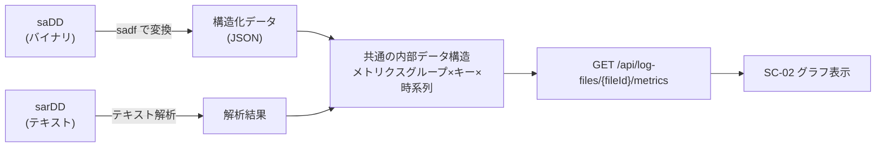
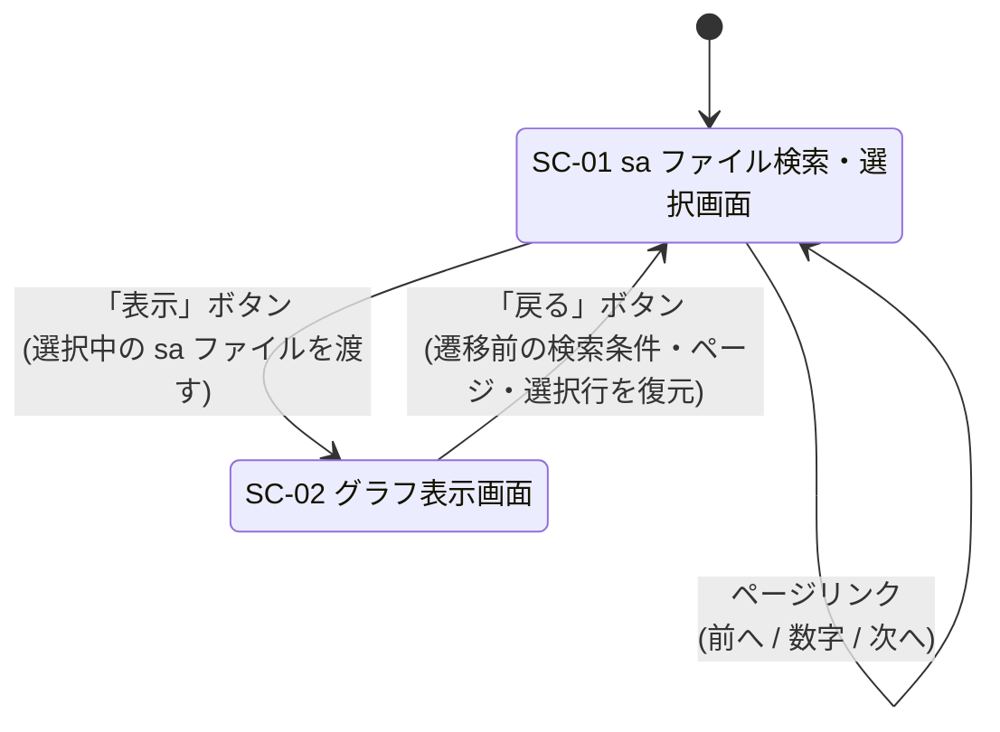

# P001 システム要件定義書 — SysstatView

* プロジェクト: SysstatView
* 作成フェーズ: P001 (Require Development Step)
* 要求元文書: `./require.txt`
* テストデータ: `./sysstat-log/var/log/sysstat/`

### 改訂履歴

| 版 | 変更内容 | 契機 |
| --- | --- | --- |
| 初版 | `require.txt` にもとづき作成。`saDD` バイナリのみを対象とした | — |
| 第2版 | **`saDD` バイナリと `sarDD` テキストの両対応**に変更。`sar` ファイルはテキストとしてそのまま読み込み、`sa` ファイルは `sadf` で変換する方式とした | 利用者からの追加指示 |

* 第2版の変更は Plan Loop Step 着手前 (P001 完了直後・下流文書が未作成) に行われたため、CR (P901) ではなく本書を直接更新した。`SKILL-P901-cr-create.md` はCRの対象を「納品後 (またはPlan Loop Step完了後) の要望」と規定しており、本件はこれに該当しないため。

---

## 0. 本書の位置づけと原文の解釈

本書は `./require.txt` に記載された要求を、後続フェーズ (P002〜P009) が詳細化できる粒度に整理したものである。

### 0.1 原文の誤記に対する解釈

`require.txt` に誤記と判断した箇所があり、文脈から次のとおり解釈した。

| 原文 | 解釈 | 根拠 |
| --- | --- | --- |
| 「初期値は戦闘が選択状態になっている」 | **先頭**行のラジオボタンが選択状態 | 直前に「単一選択ができる」とあり、一覧の初期選択位置の話であるため |
| 「画面１は繊維前の状態になっている」 | 画面2へ**遷移**する前の状態が復元される | 「戻るボタンを押すと画面１に戻る」の直後であるため |

### 0.2 原文に記載が無く、本フェーズで補った事項

`require.txt` に記載が無いため本フェーズの想定で補った事項には、該当箇所に ★FIXME★ を付した。主なものは「認証の要否」「デプロイ先」「性能目標値」「グラフの描画ライブラリ」である。

---

## 1. アプリケーションの概要

### 1.1 何のためのアプリか

Linux の性能統計収集ツール **sysstat** が `/var/log/sysstat/` に日次で出力するログファイルを読み取り、その中に格納された時系列の性能データを Web ブラウザ上でグラフとして閲覧するためのアプリケーション。

対象とするファイルは次の 2 種類であり、**どちらも一覧に表示し、選択されたファイルの種類に応じて読み取り方式を切り替える**。

| 種類 | ファイル名 | 形式 | 読み取り方式 |
| --- | --- | --- | --- |
| バイナリ日次アーカイブ | `saDD` | sysstat 独自のバイナリ形式 | `sadf` コマンドで構造化データへ変換してから読む |
| テキスト日次レポート | `sarDD` | `sar -A` の出力テキスト | 変換を介さず、テキストとしてそのまま解析する |

### 1.2 誰が使うか

Linux サーバの運用担当者・インフラ担当者。sysstat を導入済みのサーバから採取した `sa` ファイル群を手元に持っており、その内容を確認したい者。

### 1.3 どんな課題を解決するか

* `saDD` はバイナリ形式であり、`sar` コマンドを対象ホスト上で叩かない限り内容を読めない。本アプリはそれをブラウザから閲覧可能にする。
* `sarDD` はテキストで読めるものの数値の羅列であり、時間変化の傾向 (CPU 使用率の山、I/O 待ちの急増など) を目視で把握しづらい。本アプリはこれをグラフ化する。
* 手元に `sa` と `sar` のどちらが揃っているかは採取元の運用によって異なる。両方を同じ画面から扱えることで、利用者はファイル形式を意識せずに閲覧できる。
* sysstat が採取する統計は 18 種類程度のグループに及ぶが、どの項目が何を意味するかは分かりづらい。本アプリは各グラフに表示内容と簡単な説明を添える。

### 1.4 スコープ外 (本バージョンで作らないもの)

意識的にスコープ外とした。★ACCEPTED★ 検討したが、`require.txt` の記載範囲を越えて工数と画面数が増え、初版の完成を遅らせるため採らなかった。残存リスク: 運用で必要になれば CR (P901) として追加起票が必要になる。

* 監視対象ホストからの `sa` ファイルの自動収集 (本アプリは収集済みファイルを読むだけ)
* 複数ホスト・複数日のグラフ重ね合わせ比較
* しきい値超過のアラート通知
* グラフ画像 / CSV のエクスポート

---

## 2. システムの前提

| 項目 | 内容 |
| --- | --- |
| 想定ユーザー数 | 同時利用 5 名程度、登録ユーザー管理は行わない ★FIXME★ (`require.txt` に記載が無いため想定) |
| 規模 | 対象ログファイルは 1 ホスト分・数か月分 (`sa` と `sar` を合わせて数十〜数百ファイル、1 ファイル約 700KB〜1MB) を想定 ★FIXME★ |
| デプロイ先 | Docker Compose による単一ノード上のコンテナ実行 (P302 が docker compose 化を求めるため) ★FIXME★ |
| 認証要否 | **不要**。社内ネットワーク内での利用を前提とし、アクセス制御はネットワーク層で担保する ★FIXME★ (`require.txt` に記載が無いため想定。必要なら CR で追加) |
| 連携する既存システム | `sa` ファイルの読み取りのみ sysstat (`sadf` コマンド) にコマンドラインで依存する。`sar` ファイルの読み取りは外部コマンドに依存しない。それ以外の外部システム連携は無し |
| 参考にする既存システム | `sar` / `sadf` コマンドの出力仕様 |
| 対象ログファイルの配置 | ホスト側のディレクトリをバックエンドコンテナに**読み取り専用**でマウントする。既定のマウント元は `./sysstat-log/var/log/sysstat/` ★FIXME★ |

### 2.1 入力データの前提 (テストデータの実測にもとづく)

`./sysstat-log/var/log/sysstat/` の実データを確認した結果、次の前提を置く。

#### (a) 両形式に共通する前提

* ファイル名は `saDD` / `sarDD` (`DD` = データが採取された**日**、2 桁ゼロ埋め)。テストデータには `sa16`〜`sa24` と `sar15`〜`sar23` が存在する。
* **ファイル名は日 (DD) しか持たないため、月をまたぐと同名ファイルが循環する。** したがって検索条件 (開始日・終了日) との突合にファイル名だけを使ってはならない。ファイル内部が持つ採取日を読み取り、それを一覧表示および期間フィルタの基準日とする (取得方法は形式ごとに異なる。下記 (b)(c) 参照)。ファイル更新日時での代替は、ファイルコピー時に更新日時が変わるため採らない。
* テストデータのサンプリング間隔は約 10 分、1 日あたり約 144 サンプル。サンプル時刻は厳密な等間隔ではない (00:10:09, 00:20:12, 00:30:03 のように揺らぐ) ため、グラフは固定間隔を仮定せず実測時刻に対してプロットする。
* テストデータの採取元ホストは 3 CPU、ネットワークインタフェースが約 30 本 (Docker 由来の `br-*` / `veth*` を含む)。**キー付きメトリクス (CPU 別・デバイス別・インタフェース別) は系列数が多くなりうる**ことを前提に画面と性能を設計する。
* **同一日について `saDD` と `sarDD` の両方が存在しうる** (テストデータでは `sa16`〜`sa23` と `sar16`〜`sar23` が重複する)。両者は同じ日のデータを別形式で保持したものだが、本アプリは**別々の 1 件として一覧に表示**し、利用者がどちらを読むか選べるようにする (`require.txt` 追加指示の「sar ファイルが選択された場合／sa が選択された場合」という記述が、両方が選択肢として並ぶことを前提としているため)。同一日での自動的な名寄せ・重複排除は行わない。

#### (b) `saDD` (バイナリ) の前提

* 先頭 4 バイトはマジックナンバー `0x96 0xD5 0x75 0x21`。この値でファイルの妥当性を一次判定できる。
* 採取日はバイナリヘッダに含まれるため、`sadf` の出力から取得する ★FIXME★ (取得に用いる具体的な `sadf` のオプションは P003 で確定する)
* 当日分は収集途中の状態でありうる (テストデータの `sa24` は他ファイルの約 1/10 のサイズ)。データが 1 日分揃っていないファイルでもエラーとせず、取得できた範囲でグラフ化する。

#### (c) `sarDD` (テキスト) の前提

テストデータの `sar15`〜`sar23` を実測して確認した、解析上の前提。これらはいずれも `sar -A` 相当の全項目出力である。

* **1 行目がヘッダ行**で、`Linux 6.8.0-106-generic (www4250uj) \t2026-08-23 \t_x86_64_\t(3 CPU)` の形式を持つ。**採取日が明示されているのはこの行だけ**であり、データ行は時刻しか持たない。したがって `sar` ファイルの採取日はこの 1 行目から取得する (バイナリと異なり外部コマンドを要しない)。ホスト名・カーネル・CPU 数もこの行から得られる。
* データは**空行で区切られたブロック**の連なりとして並ぶ。各ブロックは「列名を並べたヘッダ行」で始まり、その後にデータ行が続く。
* **同一のメトリクスグループが複数ブロックに分割され、ヘッダ行が繰り返し出現する。** テストデータでは 11 サンプルごとにブロックが切り替わり、その直前に空行とヘッダ行が再度挿入される。したがって**「空行が来たらセクションが変わる」と解釈してはならない**。列構成が同一のブロックは、同一のメトリクスグループとして連結する必要がある。これは本形式の解析における最大の誤り要因である。
* 各メトリクスグループの末尾には `Average:` で始まるブロックが置かれる。これは期間平均であって時系列サンプルではないため、**グラフの系列からは除外する**。`Average:` ブロックもヘッダ行を伴う点に注意する。
* 列は空白揃えであり固定幅ではない。連続する空白で分割して解釈する。
* キーを持つグループ (CPU 別・`DEV` 別・`IFACE` 別など) は、各データ行の 2 列目がキーになる。
* **時刻表記はロケール (`LC_TIME`) に依存する。** テストデータは 24 時間表記 (`HH:MM:SS`) だが、ロケールによっては `HH:MM:SS AM/PM` となり列位置がずれる。解析時はこの両形式を許容する ★FIXME★ (24 時間表記以外の実データを入手できていないため、想定にもとづく)
* **当日分の `sarDD` は存在しないことがある。** `sarDD` は翌日未明に cron が生成するため、テストデータでも `sa24` はあるが `sar24` は無い。当日のデータを見るには `sa` 側を選ぶ必要がある。
* 採取オプションによっては `sar -A` 相当でない (項目の少ない) `sarDD` が存在しうる。含まれないメトリクスグループはグラフを表示しない (6.2 参照)。

---

## 3. 採用技術と選定理由

### 3.1 フロントエンド: Angular

* 採用: **Angular** (TypeScript)
* 選定理由:
  * `require.txt` の「■利用フレームワーク・フロントエンド：Angular」に明記されているため。
  * 画面2 が多数のグラフを一度に描画する構成であり、Angular の変更検知制御 (`OnPush`) と遅延描画の仕組みが、描画コストの抑制に使える。
  * 画面1 の検索フォーム・ページネーション・単一選択という要件が、Angular の Reactive Forms と標準的なコンポーネント構成に素直に対応する。
* グラフ描画ライブラリ: **Chart.js** (`ng2-charts` 経由) を第一候補とする ★FIXME★ (`require.txt` に指定が無いため想定。時系列折れ線が主用途であり、系列数が多くても軽量に描けること、依存が小さいことを理由に選定。最終決定は P002 で行う)

### 3.2 バックエンド: Python / FastAPI

* 採用: **Python 3.12 + FastAPI**
* 選定理由:
  * `require.txt` の「■利用フレームワーク・バックエンド : Python」に合致し、かつフレームワークとして FastAPI を利用者が指定したため。
  * `sa` バイナリの読み取りは外部コマンド `sadf` の呼び出しと、その出力 (JSON) の整形が中心になる。Python は `subprocess` と JSON 処理が標準ライブラリで完結し、この用途に適する。
  * Pydantic による応答スキーマ定義が、後続フェーズ (P003・P007) が参照する API 仕様の記述とそのまま一致する。
  * OpenAPI スキーマが自動生成されるため、Angular 側の型定義と齟齬が出にくい。

### 3.3 ログファイルの読み取り方式 (2 系統)

ファイル形式ごとに読み取り経路を分ける。どちらの経路も、最終的に**同一の内部データ構造** (メトリクスグループ × キー × 時系列サンプル) に正規化する。これにより、SC-02 のグラフ描画と API 応答スキーマは、元ファイルの形式によらず共通になる。

#### (a) `saDD` (バイナリ) — `sadf` による変換

* 採用: **`sadf` コマンド (sysstat パッケージ) を subprocess 経由で呼び出し、JSON 出力を受け取る方式**
* ★ACCEPTED★ 検討したが採らなかった案: `sa` ファイルのバイナリ構造を自前でパースする実装。sysstat のバイナリ形式は**バージョン間で互換性が保証されておらず**、構造体定義がバージョンごとに変わるため、自前パーサは採取元の sysstat バージョンが変わるたびに壊れる。残存リスク: バックエンドコンテナに導入した sysstat のバージョンが、`sa` ファイルを生成したホストの sysstat バージョンと大きく異なる場合、`sadf` がファイルを読めない。この場合はエラーメッセージをそのまま画面に提示し、利用者が原因を判別できるようにする (要件 REQ-F-018)。**その際、同一日の `sar` ファイルが存在すればそちらを選ぶよう案内する** (両対応にしたことで、この障害には利用者側の回避手段がある)。
* 上記のため、バックエンドのコンテナイメージには **sysstat パッケージを同梱する**。
* テストデータの `sa` ファイルはフォーマットバージョン識別子を持つ。P102 の実装時に、同梱する sysstat のバージョンで実際にテストデータが読めることを確認すること。

#### (b) `sarDD` (テキスト) — 自前のテキスト解析

* 採用: **変換コマンドを介さず、アプリケーション内でテキストを直接解析する方式**
* `sar` のテキスト出力は人間可読な安定した書式であり、外部コマンドを挟む必要がない。プロセス起動のオーバーヘッドが無く、sysstat が導入されていない環境でも動作する。
* 解析上の前提と注意点 (ブロック分割・ヘッダ行の繰り返し・`Average:` 行の除外・ロケール依存) は 2.1(c) に記載したとおり。とくに**ヘッダ行の繰り返しを新しいセクションの開始と誤認しないこと**が実装上の要点である。
* ★ACCEPTED★ 検討したが採らなかった案: `sar` ファイルも `sadf` に通して形式を 1 本化する案。`sadf` はバイナリ (`sa`) を入力とするツールでありテキストの `sar` を入力にできないため、成立しない。残存リスク: 解析ロジックが 2 系統になり、両者の出力が同じ内部構造に揃っていることをテストで担保する必要がある (11.3 参照)。

#### (c) 形式の判定

* 一覧・読み取りの対象とするのは、ファイル名が `sa` + 2 桁数字、または `sar` + 2 桁数字に合致するものとする ★FIXME★ (`require.txt` に判定規則の記載が無いため、テストデータの命名にもとづき想定)
* 読み取り経路の選択はこのファイル名による判定を基本とし、`sa` と判定したファイルについては先頭 4 バイトのマジックナンバーで妥当性を追加確認する。

---

## 4. 画面一覧

| 画面ID | 画面名 | 概要 |
| --- | --- | --- |
| SC-01 | sa ファイル検索・選択画面 | 期間を指定して `sa` ファイルを検索し、一覧から 1 件を選択する |
| SC-02 | グラフ表示画面 | 選択された `sa` ファイルに格納された時系列データを、すべてグラフ表示する |

`require.txt` が定義する画面は上記 2 画面のみであり、本バージョンではこれ以外の画面を設けない。

---

## 5. 画面遷移図

---

## 6. 各画面の入出力項目

### 6.1 SC-01 sa ファイル検索・選択画面

画面は**上段 (検索エリア)** と**下段 (一覧エリア)** に分かれる。

#### 上段: 検索エリア

| 区分 | 項目名 | 内容 | 初期値 |
| --- | --- | --- | --- |
| 入力 | 開始日 | 検索対象期間の開始日 (日付) | 実行月の 1 日 |
| 入力 | 終了日 | 検索対象期間の終了日 (日付) | 実行月の末日 |
| 操作 | 検索ボタン | 指定期間に該当する `sa` ファイルを下段に一覧表示する。押下時は 1 ページ目に戻す | — |

* 「実行月」とは、画面を開いた時点のクライアントの現在日が属する月を指す ★FIXME★ (`require.txt` に基準タイムゾーンの記載が無いため、クライアントのローカル日付を採用すると想定)
* 開始日 > 終了日 の場合はエラーメッセージを表示し、検索を実行しない ★FIXME★ (`require.txt` に記載が無いため想定)

#### 下段: 一覧エリア

| 区分 | 項目名 | 内容 |
| --- | --- | --- |
| 表示 | ラジオボタン | 行の単一選択用。一覧内で 1 行のみ選択できる |
| 表示 | ファイル名 | ログファイルのファイル名 (例: `sa23`, `sar23`) |
| 表示 | 種別 | `sa` (バイナリ) / `sar` (テキスト) の別 ★FIXME★ (`require.txt` に記載は無いが、同一日について両形式が並ぶため、どちらを選んでいるかを利用者が判別できる必要があると判断して追加した) |
| 表示 | 採取日 | ファイル内部から取得した採取日 ★FIXME★ (`require.txt` に記載は無いが、ファイル名が日 (DD) しか持たず月をまたいで循環する以上、ファイル名だけでは日付を一意に判別できないため表示項目として追加した) |
| 操作 | ページリンク | `<前へ 1 2 3 4 次へ>` 形式。1 ページ 10 件 |
| 操作 | 表示ボタン | 選択中のログファイルを対象に SC-02 へ遷移する |

* 一覧の並び順は、採取日の昇順、同一採取日では `sa` → `sar` の順とする ★FIXME★ (`require.txt` に記載が無いため想定)

* 一覧は 1 ページあたり **10 件**固定。
* 初期状態では、表示中ページの**先頭行**のラジオボタンが選択状態になっている。
* 検索結果が 0 件の場合は、その旨のメッセージを表示し、表示ボタンを非活性にする ★FIXME★ (`require.txt` に記載が無いため想定)
* ページを切り替えた場合も、切り替え先ページの先頭行が選択状態になる ★FIXME★ (`require.txt` に「初期値は先頭が選択状態」とあるが、ページ切り替え時の挙動の記載が無いため、初期表示と同じ挙動に揃えると想定)

#### 状態復元

SC-02 から「戻る」で復帰した場合、次の状態を遷移前と同一に復元する。

* 検索条件 (開始日・終了日)
* 検索結果の一覧
* 表示していたページ番号
* 選択されていた行

### 6.2 SC-02 グラフ表示画面

| 区分 | 項目名 | 内容 |
| --- | --- | --- |
| 表示 | ファイル名 | SC-01 で選択されたログファイル名 |
| 表示 | 種別・採取日 | そのファイルの種別 (`sa` / `sar`) と採取日 ★FIXME★ (どちらの形式を読んだ結果を見ているかが分かるようにするため追加) |
| 表示 | グラフ見出し | 各グラフの前に表示する、そのグラフが何を表しているかの名称 |
| 表示 | グラフ説明 | 各グラフの前に表示する、指標の意味の簡単な説明 (日本語) |
| 表示 | グラフ | 時系列の折れ線グラフ。X 軸 = 採取時刻、Y 軸 = 指標値。凡例に系列名 |
| 操作 | 戻るボタン | SC-01 に戻る (遷移前の状態を復元) |

* 選択されたログファイルに格納されている時系列データを**すべて**グラフ表示する。表示対象のメトリクスグループは「7. メトリクスグループ一覧」のとおり。
* **グラフの構成・見た目は、元ファイルが `sa` か `sar` かによって変わらない。** 3.3 のとおり両経路とも同一の内部データ構造に正規化するため、同一日の `sa23` と `sar23` を開いた場合、表示されるグラフは同じ構成になる (数値も一致する。11.3 の検証観点)。
* キーを持つメトリクスグループ (CPU 別・ブロックデバイス別・ネットワークインタフェース別) は、**キーごとに 1 本の系列**として同一グラフ内に描画する。
* 対象の `sa` ファイルにデータが含まれないメトリクスグループは、グラフ枠ごと表示しない (空のグラフを並べない) ★FIXME★ (`require.txt` に記載が無いため想定)
* グラフ本数が多くなるため、画面内に入ったグラフから順に描画する遅延描画とする (「10. 非機能要件」の性能要件を満たすため)

---

## 7. メトリクスグループ一覧

テストデータ (`sa16`〜`sa24`) に実際に含まれていた統計項目を調査し、次の 18 グループを表示対象とする。各グループが SC-02 の 1 グラフ (キー付きの場合は 1 グラフ内の複数系列) に対応する。「説明」は SC-02 の「グラフ説明」に表示する文言の元とする。

| # | グループID | 表示名 | キー | 主な指標 | 説明 (SC-02 表示文言の元) |
| --- | --- | --- | --- | --- | --- |
| 1 | MG-CPU | CPU 使用率 | CPU (all/0/1/...) | `%usr` `%nice` `%sys` `%iowait` `%steal` `%irq` `%soft` `%idle` | CPU 時間の内訳。`%iowait` が高ければ I/O 待ち、`%steal` が高ければ仮想化基盤側での取られ待ちを疑う |
| 2 | MG-PROC | プロセス生成・コンテキストスイッチ | なし | `proc/s` `cswch/s` | 1 秒あたりのプロセス生成数と、コンテキストスイッチ回数 |
| 3 | MG-SWPIO | スワップイン / アウト | なし | `pswpin/s` `pswpout/s` | 1 秒あたりにスワップ領域と交換されたページ数。恒常的に発生していればメモリ不足 |
| 4 | MG-PAGE | ページング | なし | `pgpgin/s` `pgpgout/s` `fault/s` `majflt/s` `pgfree/s` `pgscank/s` `pgscand/s` `pgsteal/s` `%vmeff` | メモリページの入出力とページフォールトの発生状況 |
| 5 | MG-IO | ブロック I/O (全体) | なし | `tps` `rtps` `wtps` `dtps` `bread/s` `bwrtn/s` `bdscd/s` | システム全体の 1 秒あたり I/O 転送回数と転送ブロック数 |
| 6 | MG-MEM | メモリ使用量 | なし | `kbmemfree` `kbavail` `kbmemused` `%memused` `kbbuffers` `kbcached` `kbcommit` `%commit` `kbdirty` `kbslab` ほか | 物理メモリの使用状況。`kbavail` が実質的な空き容量 |
| 7 | MG-SWAP | スワップ使用量 | なし | `kbswpfree` `kbswpused` `%swpused` `kbswpcad` `%swpcad` | スワップ領域の使用状況 |
| 8 | MG-HUGE | HugePages | なし | `kbhugfree` `kbhugused` `%hugused` `kbhugrsvd` `kbhugsurp` | HugePages の割り当て状況 |
| 9 | MG-KTBL | カーネルテーブル | なし | `dentunusd` `file-nr` `inode-nr` `pty-nr` | ファイルディスクリプタ・inode などカーネル内テーブルの使用数 |
| 10 | MG-LOAD | ロードアベレージ・実行キュー | なし | `runq-sz` `plist-sz` `ldavg-1` `ldavg-5` `ldavg-15` `blocked` | 実行待ちタスク数とロードアベレージ。CPU 数を継続的に超えていれば過負荷 |
| 11 | MG-TTY | TTY デバイス | TTY | `rcvin/s` `xmtin/s` `framerr/s` `prtyerr/s` `brk/s` `ovrun/s` | シリアル端末の送受信・エラー発生状況 |
| 12 | MG-DISK | ブロックデバイス別 I/O | DEV (`vda` など) | `tps` `rkB/s` `wkB/s` `dkB/s` `areq-sz` `aqu-sz` `await` `%util` | デバイスごとの I/O 量と応答時間。`%util` が 100% に張り付けば飽和、`await` はレイテンシ |
| 13 | MG-NET | ネットワーク I/O | IFACE (`ens3` など) | `rxpck/s` `txpck/s` `rxkB/s` `txkB/s` `rxcmp/s` `txcmp/s` `rxmcst/s` `%ifutil` | インタフェースごとの送受信パケット数・転送量 |
| 14 | MG-NETERR | ネットワークエラー | IFACE | `rxerr/s` `txerr/s` `coll/s` `rxdrop/s` `txdrop/s` `txcarr/s` `rxfram/s` `rxfifo/s` `txfifo/s` | インタフェースごとのエラー・破棄パケット数。通常はすべて 0 |
| 15 | MG-NFSC | NFS クライアント | なし | `call/s` `retrans/s` `read/s` `write/s` `access/s` `getatt/s` | NFS クライアントとしての RPC 発行状況 |
| 16 | MG-NFSD | NFS サーバ | なし | `scall/s` `badcall/s` `packet/s` `udp/s` `tcp/s` `hit/s` `miss/s` ほか | NFS サーバとしての RPC 受信状況 |
| 17 | MG-SOCK | ソケット使用数 | なし | `totsck` `tcpsck` `udpsck` `rawsck` `ip-frag` `tcp-tw` | 使用中ソケット数。`tcp-tw` は TIME_WAIT 状態の数 |
| 18 | MG-SOFTNET | ソフトネット処理 | CPU | `total/s` `dropd/s` `squeezd/s` `rx_rps/s` `flw_lim/s` `blg_len` | CPU ごとのネットワークパケットのソフト割り込み処理状況 |

* 上表は**テストデータの `sar` ファイル (`sar -A` 相当の全項目出力) に含まれていた項目**を実測して整理したものである。`sa` ファイルは同じ日の `sar` ファイルの元データであるため、同一のグループ構成になる。
* 採取オプションの異なるファイルでは一部グループが存在しないことがあるため、グループの有無はファイルごとに判定する (6.2 参照)。
* 上表に無いグループがファイルに含まれていた場合の扱いは P003 で定める ★FIXME★
* `sa` 経路 (`sadf` の出力) と `sar` 経路 (テキスト解析) で、同じグループに同じグループ ID を割り当てる対応表を持つ必要がある。両経路で項目名の表記が異なりうるため ★FIXME★ (対応表の具体的な定義は P003 で確定する)

---

## 8. 入出力に紐づくバックエンド API

| 画面 | 操作・表示 | 呼び出す API |
| --- | --- | --- |
| SC-01 | 画面初期表示 (実行月の期間で自動検索) | `GET /api/log-files` |
| SC-01 | 検索ボタン押下 | `GET /api/log-files` |
| SC-01 | ページリンク押下 | `GET /api/log-files` (`page` を変更) |
| SC-01 | 表示ボタン押下 | (API 呼び出しなし。SC-02 へ遷移) |
| SC-02 | 画面初期表示 (グラフ描画) | `GET /api/log-files/{fileId}/metrics` |
| SC-02 | グラフ見出し・説明の表示 | `GET /api/metric-catalog` |
| SC-02 | 戻るボタン押下 | (API 呼び出しなし。SC-01 へ遷移) |
| — | 死活監視 | `GET /api/health` |

---

## 9. バックエンド API 一覧

| メソッド | パス | 用途 |
| --- | --- | --- |
| GET | `/api/health` | 死活確認。バックエンドと `sadf` コマンドの利用可否を返す (`sadf` が使えない場合も `sar` は読めるため、その旨を区別して返す) |
| GET | `/api/log-files` | 指定期間 (`from`, `to`) に該当するログファイル (`sa` / `sar` の両方) を、ページ (`page`, `perPage`) 単位で返す。各件に種別と採取日を含む。総件数・総ページ数を含む |
| GET | `/api/log-files/{fileId}/metrics` | 指定ログファイルに含まれる全メトリクスグループの時系列データを返す。応答スキーマは種別によらず共通 |
| GET | `/api/metric-catalog` | メトリクスグループの表示名・説明・指標定義 (「7. メトリクスグループ一覧」の内容) を返す |

* `fileId` はファイルパスを直接受け取らず、バックエンドが払い出す不透明な識別子とする。パストラバーサルを防ぐため ★ACCEPTED★ 検討したが採らなかった案: ファイル名をそのままパスパラメータにする方式。実装は簡単だが `../` を含む入力の検証責務がハンドラ側に散るため採らなかった。残存リスク: 識別子の払い出し表をバックエンドが保持する必要がある (詳細は P003)。
* `require.txt` の「バックエンド処理」に挙げられた 2 項目との対応:
  * 「saファイル一覧取得」→ `GET /api/log-files` (追加指示により `sar` も対象に含む)
  * 「saファイル読み込み処理 (バイナリ形式の.saファイルを読み込める形にする)」→ `GET /api/log-files/{fileId}/metrics` (内部で `sadf` を用いてバイナリを構造化データへ変換する。`sar` の場合はテキストを直接解析する)

---

## 10. 非機能要件

### 10.1 性能

| 項目 | 目標 |
| --- | --- |
| `GET /api/log-files` の応答時間 | P95 < 1 秒 (対象ファイル 400 件程度まで) ★FIXME★ |
| `GET /api/log-files/{fileId}/metrics` の応答時間 | 初回 P95 < 5 秒、キャッシュ命中時 P95 < 1 秒 (1 ファイル約 700KB〜1MB / 約 144 サンプル)。`sa` / `sar` のいずれの経路でも同じ目標とする ★FIXME★ |
| SC-02 の初期表示 | 最初のグラフが 3 秒以内に描画されること。残りは遅延描画でよい ★FIXME★ |

* **一覧表示のたびに全ファイルの中身を読むことは避ける。** `sa` の採取日取得は件数分の `sadf` プロセス起動を伴い、`sar` も 1 行目を読むためのファイルオープンを伴うため、いずれも採取日をキャッシュする。キャッシュの失効判断にはファイルの更新日時とサイズを用いる ★FIXME★ (具体的なキャッシュ方式は P003 で確定)
* `sar` の採取日取得は 1 行目のみを読めば足りるため、ファイル全体を読み込まない実装とする。
* 上記の目標値はいずれも `require.txt` に記載が無く、テストデータの規模から本フェーズで設定した想定値である。

### 10.2 可用性

* Docker Compose による単一ノード構成。冗長化は行わない。★ACCEPTED★ 検討したが採らなかった案: 複数ノードでの冗長構成。閲覧専用のツールであり、停止しても業務が止まらないため採らなかった。残存リスク: ノード障害時はアプリが利用できない。
* コンテナは異常終了時に自動再起動する (`restart: unless-stopped`)。
* 稼働率の数値目標は定めない。

### 10.3 セキュリティ

* 認証は行わない ★FIXME★ (2章の前提と同じ。社内ネットワーク内利用を想定)
* `sa` ファイルの配置ディレクトリは、バックエンドコンテナに**読み取り専用**でマウントする。アプリからのファイル書き込み・削除は一切行わない。
* API はファイルパスを直接受け付けず、不透明な `fileId` 経由でのみファイルにアクセスする (9章参照)。
* `sadf` の呼び出しではシェルを介さず引数配列で起動し、ユーザー入力を引数へそのまま連結しない (コマンドインジェクション防止)。
* 検索条件の日付は形式・範囲を検証したうえで使用する。
* HTTPS 終端は本アプリの責務外とする ★ACCEPTED★ 検討したが採らなかった案: アプリ内での TLS 終端。証明書の配置・更新をアプリが抱えることになり、社内利用という前提に対して過剰なため採らなかった。残存リスク: 平文通信となるため、社内ネットワーク外への公開時は前段にリバースプロキシが必要 (P302 の配布手順に明記すること)。

### 10.4 スケーラビリティ

* 単一プロセス構成を基本とし、負荷に応じて ASGI サーバのワーカー数で調整する。
* 想定同時利用者数は 5 名 ★FIXME★。これを大きく超える利用は想定しない。

### 10.5 ログ出力先とその監視方法

* アプリケーションログは**標準出力**へ出力し、`docker compose logs` で参照する。ファイルへの直接出力は行わない。
* 出力形式は 1 行 1 レコードの構造化ログ (JSON) とする ★FIXME★ (`require.txt` に記載が無いため想定)
* 少なくとも次を記録する: API リクエスト (メソッド・パス・ステータス・所要時間)、`sadf` の起動と終了コード、`sa` ファイルの読み取り失敗とその理由。
* ログ集約基盤への転送は行わない ★ACCEPTED★ 検討したが採らなかった案: Fluent Bit などによる集約。単一ノードの閲覧ツールに対して構成が過剰なため採らなかった。残存リスク: コンテナを破棄するとログが失われる。

### 10.6 ユーザビリティ・その他

* 対応ブラウザは Chrome / Edge の最新版とする ★FIXME★
* 画面表示言語は日本語のみ。多言語化は行わない。
* SC-02 のグラフ説明は、sysstat の指標に不慣れな運用担当者が読んで意味を把握できる日本語であること (7章の「説明」列を参照)。

---

## 11. テスト方針

詳細なテスト計画は P006 で策定する。本フェーズでは方針のみ定める。

### 11.1 テストレベルと担当

| レベル | 対象 | 方針 |
| --- | --- | --- |
| 単体テスト (バックエンド) | `sar` テキスト解析ロジック、`sadf` 出力の変換ロジック、期間フィルタ、ページング、メトリクスグループ判定 | pytest。`sar` 解析は実データを直接読ませる。`sadf` の呼び出しはスタブ化し、実出力を模した固定データで検証する |
| 単体テスト (フロントエンド) | 検索フォームの初期値・入力検証、ページネーション、単一選択、状態復元 | Angular 標準のテスト環境を用いる |
| 結合テスト | API 単位の疎通と応答内容 (P008 で定義) | 実際の `sa` / `sar` ファイルを読ませ、`sadf` を実行できるコンテナ内で実施する |
| 受け入れ結合テスト | SC-01 → SC-02 → SC-01 の一連の操作 (P009 で定義) | ブラウザ自動操作により、画面遷移と状態復元まで含めて検証する。`sa` を選んだ場合と `sar` を選んだ場合の両方を通す |

### 11.2 テストデータ

* `./sysstat-log/var/log/sysstat/` に配置された実データ (`sa16`〜`sa24`、`sar15`〜`sar23`) を、そのままテストフィクスチャとして使用する。
* `sa24` は 1 日分に満たない収集途中のファイルであり、**部分データの正常処理を確認するケースとして利用する**。
* `sar15` は対応する `sa15` が存在せず、`sa24` は対応する `sar24` が存在しない。**片側の形式しか無い日**が正しく一覧に現れることの確認に利用する。
* `sa16`〜`sa23` と `sar16`〜`sar23` は同一日について両形式が揃っている。**両経路の結果が一致すること**の確認 (11.3) に利用する。
* 検索期間の境界 (開始日と同日・終了日と同日・範囲外)、ページ境界 (10 件ちょうど・11 件) を確認できるよう、必要に応じてファイルを追加配置する。テストデータは `sa` 9 件 + `sar` 9 件 = 18 件であり、1 ページ 10 件に対して 2 ページ目が生じる規模である。

### 11.3 特に重点を置く観点

* **2 経路の結果一致**: 同一日の `sa23` と `sar23` を読んだ結果が、メトリクスグループ構成・キー・サンプル時刻・数値において一致すること。**両対応にしたことで生じた最大のリスクがこの不一致**であり、重点的に検証する (3.3(b) の残存リスクに対応)。
* **`sar` テキスト解析の書式耐性**: ヘッダ行の繰り返しを新セクションと誤認しないこと、`Average:` 行が系列に混入しないこと、空行で区切られたブロックが正しく連結されること (2.1(c) に挙げた誤り要因に対応)。
* **`sadf` への依存**: 同梱した sysstat のバージョンで、テストデータの `sa` ファイルが実際に読めること。読めない場合の異常系がエラーとして画面に伝わること (3.3(a) の残存リスクに対応)。
* **状態復元**: SC-02 から戻った SC-01 が、検索条件・ページ・選択行まで遷移前と一致すること (`require.txt` に明記された要求のため)。
* **系列数の多さ**: ネットワークインタフェースが約 30 本ある実データで、SC-02 が破綻せず描画できること。
* **テストスイートの再実行可能性**: テストスイートを 2 回続けて実行しても同じ結果になること。

---

## 12. 要求事項一覧 (トレーサビリティ用)

P004 要求トレーサビリティマトリクスの突合対象となる要求事項を、識別子付きで列挙する。「出典」列の「原文」は `require.txt` に明記された要求、「補完」は本フェーズが想定で補った要求を指す。

### 12.1 機能要求

| 要求ID | 要求事項 | 出典 |
| --- | --- | --- |
| REQ-F-001 | sysstat が出力する `saDD` バイナリファイルを読み取り、内容をグラフとして表示できること | 原文 |
| REQ-F-002 | ログファイルの採取日を、ファイル名ではなくファイル内部の情報から判定すること | 補完 |
| REQ-F-003 | SC-01 上段で、検索対象期間の開始日・終了日を入力できること | 原文 |
| REQ-F-004 | SC-01 の開始日・終了日の初期値が、実行月の 1 日と末日であること | 原文 |
| REQ-F-005 | SC-01 の検索ボタン押下で、期間に該当する `sa` ファイルの一覧が下段に表示されること | 原文 |
| REQ-F-006 | SC-01 下段の一覧が、1 行につきラジオボタンとファイル名を持つテーブル形式であること | 原文 |
| REQ-F-007 | SC-01 下段の一覧が 1 ページ 10 件で、単一選択できること | 原文 |
| REQ-F-008 | SC-01 下段の一覧の下に `<前へ 1 2 3 4 次へ>` 形式のページリンクがあり、ページを切り替えられること | 原文 |
| REQ-F-009 | SC-01 の一覧の初期選択が先頭行であること | 原文 |
| REQ-F-010 | SC-01 の表示ボタン押下で SC-02 へ遷移すること | 原文 |
| REQ-F-011 | SC-02 に、選択された `sa` ファイル名が表示されること | 原文 |
| REQ-F-012 | SC-02 に、選択された `sa` ファイルに格納された時系列データがすべてグラフ表示されること | 原文 |
| REQ-F-013 | SC-02 の各グラフの前に、表示内容の名称と簡単な説明が表示されること | 原文 |
| REQ-F-014 | SC-02 の戻るボタン押下で SC-01 に戻り、遷移前の状態 (検索条件・一覧・ページ・選択行) が復元されること | 原文 |
| REQ-F-015 | バックエンドがログファイルの一覧取得機能を提供すること | 原文 |
| REQ-F-016 | バックエンドがバイナリ形式の `sa` ファイルを読み取り、構造化データへ変換する機能を提供すること | 原文 |
| REQ-F-017 | `sa` ファイルと `sar` ファイルの両方が一覧に表示され、選択できること | 追加指示 |
| REQ-F-018 | ログファイルの読み取りに失敗した場合、その理由が利用者に判別できる形で提示されること | 補完 |
| REQ-F-019 | 収集途中で 1 日分に満たないログファイルも、取得できた範囲でグラフ表示できること | 補完 |
| REQ-F-020 | 検索結果が 0 件の場合、その旨が表示され表示ボタンが押せないこと | 補完 |
| REQ-F-021 | 開始日 > 終了日 の場合にエラーを表示し、検索を実行しないこと | 補完 |
| REQ-F-022 | `sar` ファイルが選択された場合、変換を介さずテキストとして直接解析すること | 追加指示 |
| REQ-F-023 | `sa` ファイルが選択された場合、`sadf` で構造化データへ変換してから解析すること | 追加指示 |
| REQ-F-024 | `sa` 経路と `sar` 経路の結果が、同一の内部データ構造・同一の API 応答スキーマに正規化されること | 追加指示から導出 |
| REQ-F-025 | 一覧に各ファイルの種別 (`sa` / `sar`) が表示され、利用者が判別できること | 補完 |
| REQ-F-026 | 同一日に `sa` と `sar` の両方が存在する場合、両方が別々の行として一覧に表示されること | 追加指示から導出 |
| REQ-F-027 | `sar` テキストの解析において、繰り返されるヘッダ行を新しいセクションと誤認せず、同一列構成のブロックを 1 グループとして連結すること | 実データ調査 |
| REQ-F-028 | `sar` テキストの解析において、`Average:` 行を時系列サンプルから除外すること | 実データ調査 |
| REQ-F-029 | `sar` ファイルの採取日を、1 行目のヘッダ行から取得すること | 実データ調査 |

### 12.2 非機能要求

| 要求ID | 要求事項 | 出典 |
| --- | --- | --- |
| REQ-N-001 | フロントエンドを Angular で実装すること | 原文 |
| REQ-N-002 | バックエンドを Python (FastAPI) で実装すること | 原文 + 利用者指定 |
| REQ-N-003 | `GET /api/log-files` の応答時間が P95 < 1 秒であること | 補完 |
| REQ-N-004 | `GET /api/log-files/{fileId}/metrics` の応答時間が初回 P95 < 5 秒、キャッシュ命中時 P95 < 1 秒であること | 補完 |
| REQ-N-005 | SC-02 の最初のグラフが 3 秒以内に描画されること | 補完 |
| REQ-N-006 | `sa` ファイル配置ディレクトリを読み取り専用でマウントし、アプリから書き込み・削除を行わないこと | 補完 |
| REQ-N-007 | API がファイルパスを直接受け付けず、不透明な識別子経由でファイルにアクセスすること | 補完 |
| REQ-N-008 | `sadf` の呼び出しでシェルを介さず、ユーザー入力を引数へ連結しないこと | 補完 |
| REQ-N-009 | アプリケーションログを標準出力へ構造化形式で出力すること | 補完 |
| REQ-N-010 | Docker Compose で単一ノードに配備でき、コンテナが異常終了時に自動再起動すること | 補完 |
| REQ-N-011 | バックエンドコンテナに sysstat を同梱し、`sadf` が利用可能であること | 補完 |
| REQ-N-012 | 同時利用者 5 名程度で上記性能要件を満たすこと | 補完 |
| REQ-N-013 | 画面表示言語が日本語であること | 補完 |
| REQ-N-014 | テストスイートを 2 回続けて実行しても同じ結果になること | 補完 |
| REQ-N-015 | `sar` ファイルの読み取りが外部コマンドに依存せず、`sadf` が使えない環境でも動作すること | 追加指示から導出 |
| REQ-N-016 | 一覧表示のために全ファイルの中身を読まないこと (採取日をキャッシュすること) | 補完 |

* 注: 上表の行順は P011 影響分析 #3 にもとづき ID 昇順へ並べ替えた。**要求 ID と各行の内容は変更していない。**

---

## 13. 本フェーズの未確定事項 (★FIXME★ の要約)

本節は所在の索引であり、判断の理由は各記述に隣接して記載してある。人間の確認が必要な箇所は、文書全体を "★FIXME★" で検索すること。

主な未確定事項は次の 5 点に集約される。

1. **認証の要否** (2章・10.3) — 不要と想定した。必要であれば画面数とテストケースが増える。
2. **性能目標値** (10.1) — テストデータの規模から想定値を置いた。実運用のファイル件数によっては見直しが必要。
3. **グラフ描画ライブラリ** (3.1) — Chart.js を第一候補としたが、P002 で最終決定する。
4. **`sa` ファイルから採取日を取得する具体的手段** (2.1(b)) — 方針のみ定め、手段は P003 で確定する。
5. **ログファイルの配置場所とマウント方法** (2章) — テストデータの位置を既定としたが、実運用の配置は未確定。
6. **`sar` テキストのロケール差異** (2.1(c)) — 24 時間表記以外の実データを入手できていないため、AM/PM 表記への対応は想定にとどまる。
7. **2 経路のメトリクスグループ対応表** (7章) — `sadf` 出力とテキスト解析で項目名の表記が異なりうるため、対応表の定義を P003 で確定する。
