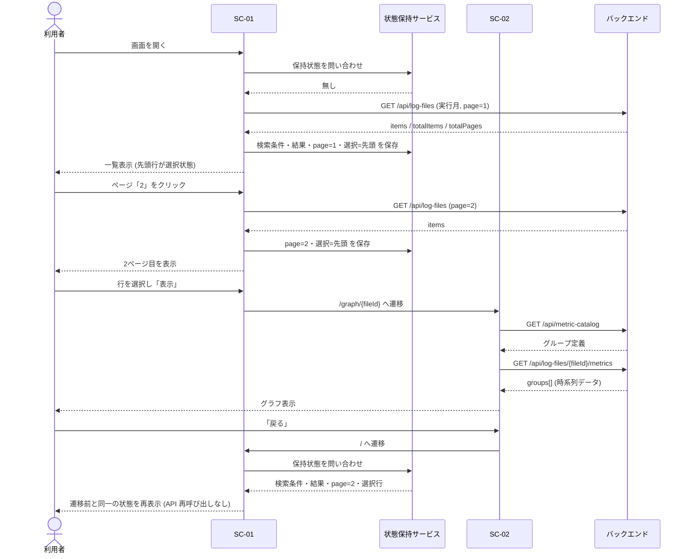
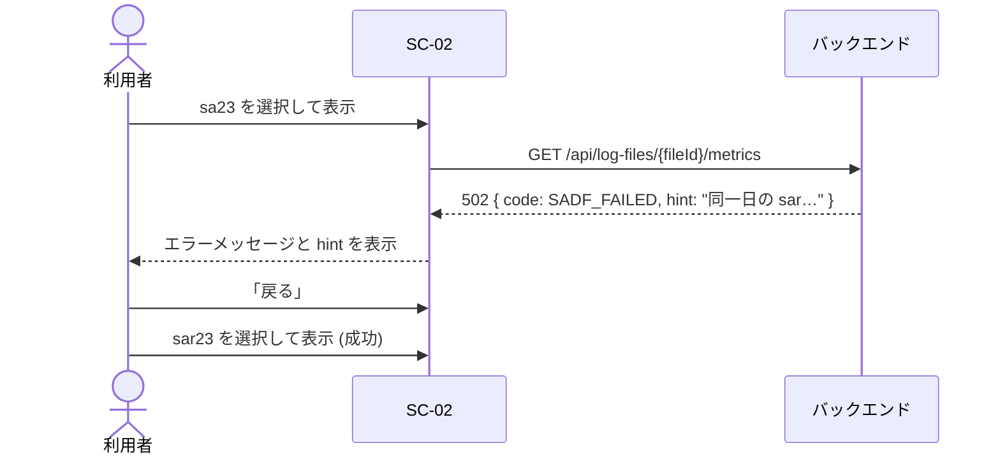
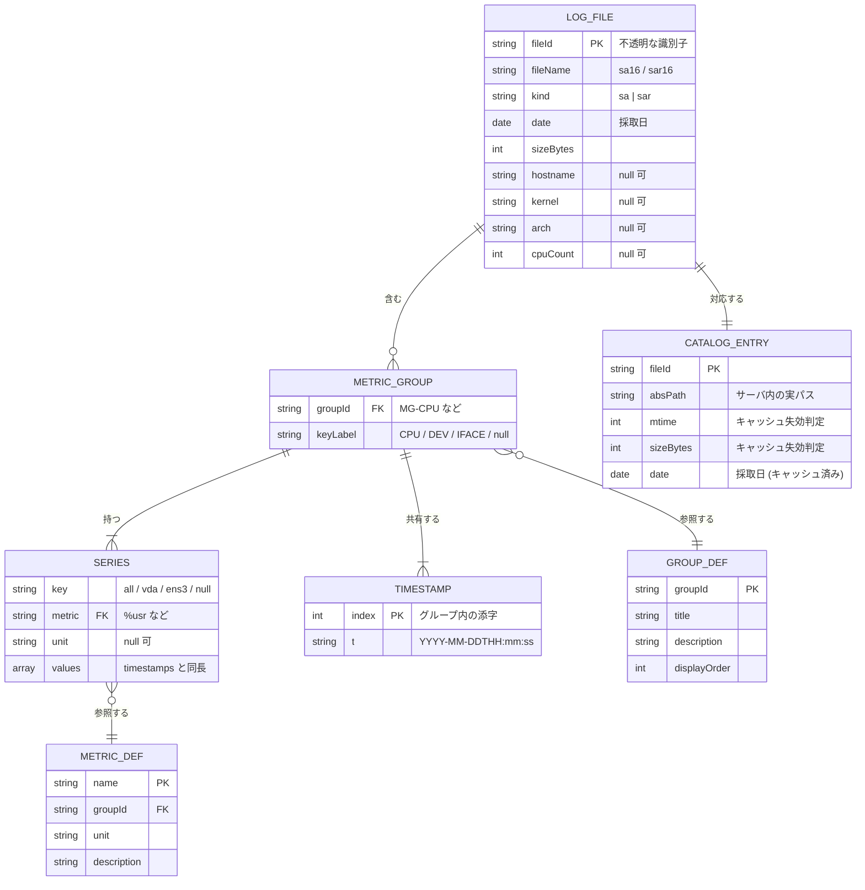

# P002 ユーザインタフェース設計書 — SysstatView

* 作成フェーズ: P002 (Plan Loop Step)
* 上位文書: `docs/P001-requirement.md`

本書は `docs/P001-requirement.md` で定めた 2 画面 (SC-01 / SC-02) と 4 エンドポイントについて、外部から見える契約を確定する。P001 に無い画面・API をここで追加していない。

---

## 1. 画面共通仕様

### 1.1 画面構成と状態管理

* 単一ページアプリケーション (Angular) とし、ルーティングで SC-01 / SC-02 を切り替える。
  * `/` → SC-01 (ログファイル検索・選択画面)
  * `/graph/:fileId` → SC-02 (グラフ表示画面)
* **SC-01 の状態 (検索条件・検索結果・ページ番号・選択行) は、画面コンポーネントの外側 (アプリケーションスコープのサービス) に保持する。** SC-02 へ遷移して戻った際にコンポーネントが再生成されても状態が失われないようにするため (REQ-F-014)。
* 状態の保持範囲はブラウザのメモリ内とし、リロードでは失われてよい ★ACCEPTED★ 検討したが採らなかった案: sessionStorage / URL クエリへの永続化。`require.txt` の要求は「戻るボタンで遷移前の状態に戻ること」であってリロード耐性ではなく、実装とテストが増えるため採らなかった。残存リスク: ブラウザのリロード後は初期状態 (実行月の期間で再検索) に戻る。

### 1.2 共通表示

| 状態 | 表示 |
| --- | --- |
| API 通信中 | 対象領域にローディング表示を出し、操作ボタンを非活性にする |
| API がエラー応答を返した | エラーメッセージ領域に `error.message` を表示する。`error.hint` があれば併記する |
| API に到達できない (ネットワークエラー) | 「バックエンドに接続できません」と表示する |

* 表示言語は日本語のみ (REQ-N-013)。
* 日付の表示形式は `YYYY-MM-DD`、日時の表示形式は `YYYY-MM-DD HH:mm:ss` に統一する。

---

## 2. SC-01 ログファイル検索・選択画面

### 2.1 画面レイアウト

```
┌─────────────────────────────────────────────┐
│ SysstatView                                  │
├─────────────────────────────────────────────┤
│ 【上段: 検索エリア】                          │
│  開始日 [2026-08-01]  終了日 [2026-08-31]     │
│                                  [ 検索 ]     │
│  (エラーメッセージ領域)                       │
├─────────────────────────────────────────────┤
│ 【下段: 一覧エリア】   全 18 件               │
│  ┌───┬──────────┬────────┬────────────┐      │
│  │   │ ファイル名 │ 種別   │ 採取日      │      │
│  ├───┼──────────┼────────┼────────────┤      │
│  │ ● │ sa16      │ sa     │ 2026-08-16 │      │
│  │ ○ │ sar16     │ sar    │ 2026-08-16 │      │
│  │ … │ …         │ …      │ …          │      │
│  └───┴──────────┴────────┴────────────┘      │
│         <前へ  1  2  次へ>                    │
│                                  [ 表示 ]     │
└─────────────────────────────────────────────┘
```

### 2.2 入力項目とバリデーションルール

| 項目 | UI | 必須 | 形式 | 範囲 | 初期値 | 違反時の挙動 |
| --- | --- | --- | --- | --- | --- | --- |
| 開始日 | `<input type="date">` | ○ | `YYYY-MM-DD` | 1970-01-01 〜 2999-12-31 | 実行月の 1 日 | 未入力・不正形式のとき「開始日を正しく入力してください」を表示し、検索を実行しない |
| 終了日 | `<input type="date">` | ○ | `YYYY-MM-DD` | 1970-01-01 〜 2999-12-31 | 実行月の末日 | 未入力・不正形式のとき「終了日を正しく入力してください」を表示し、検索を実行しない |

#### 相関バリデーション

| ルール | メッセージ | 挙動 |
| --- | --- | --- |
| 開始日 ≤ 終了日 であること (REQ-F-021) | 「開始日は終了日以前の日付を指定してください」 | 検索ボタンを押しても API を呼ばない |

* 「実行月」はクライアントのローカル日付が属する月とする (P001 §6.1 の想定を踏襲)。月末日は月ごとの日数 (うるう年を含む) から算出する。
* バリデーションはクライアント側で行うが、**同一の検証をバックエンドでも行う** (クライアント検証は迂回可能なため)。バックエンド側の規則は §5.2 に定義する。

### 2.3 一覧エリアの仕様

| 項目 | 仕様 |
| --- | --- |
| 表示列 | ラジオボタン / ファイル名 / 種別 / 採取日 |
| 1 ページの件数 | 10 件固定 (REQ-F-007) |
| 並び順 | 採取日 昇順 → 同一採取日は `sa` → `sar` の順 → 同一の場合はファイル名昇順 |
| 選択 | ラジオボタンによる単一選択 (name 属性を共通化) |
| 初期選択 | 表示中ページの先頭行 (REQ-F-009) |
| ページ切り替え時の選択 | 切り替え先ページの先頭行を選択する |
| 検索実行時のページ | 常に 1 ページ目に戻す |
| 0 件時 | 「該当するログファイルがありません」を表示し、テーブルとページリンクを表示しない。表示ボタンを非活性にする (REQ-F-020) |

#### ページリンクの仕様

* 形式は `<前へ 1 2 3 4 次へ>` (REQ-F-008)。
* 「前へ」は 1 ページ目で非活性、「次へ」は最終ページで非活性。
* 数字リンクは全ページ分を表示する。現在ページはリンクにせず強調表示する。
* 総ページ数が 1 の場合もページリンク領域を表示する (「前へ」「次へ」はともに非活性) ★FIXME★ (`require.txt` に記載が無いため想定)
* 総ページ数が多い場合の省略表示 (`1 2 … 9 10`) は行わない ★ACCEPTED★ 検討したが採らなかった案: 省略表示。想定規模 (数十〜数百ファイル ÷ 10 件 = 最大数十ページ) では実用上支障がなく、`require.txt` の記載どおりの単純な形式を保つほうが要求に忠実なため。残存リスク: ファイルが数千件になるとページリンクが横に長くなる。

### 2.4 操作と遷移

| 操作 | 前提条件 | 動作 |
| --- | --- | --- |
| 画面初期表示 | — | 実行月の期間で `GET /api/log-files` を自動実行する (REQ-F-004) |
| 検索ボタン | バリデーション通過 | `page=1` で `GET /api/log-files` を実行し、一覧を更新する |
| ページリンク | — | `page` を変更して `GET /api/log-files` を実行する |
| 表示ボタン | 行が選択されている | `/graph/:fileId` へ遷移する (REQ-F-010) |

---

## 3. SC-02 グラフ表示画面

### 3.1 画面レイアウト

```
┌─────────────────────────────────────────────┐
│ [ ← 戻る ]   sar23  (種別: sar / 2026-08-23) │
│              www4250uj / 6.8.0-106-generic   │
│              x86_64 / 3 CPU                  │
├─────────────────────────────────────────────┤
│ ■ CPU 使用率                                 │
│   CPU 時間の内訳。%iowait が高ければ…         │
│   ┌───────────────────────────────┐          │
│   │  (折れ線グラフ)                │          │
│   └───────────────────────────────┘          │
│                                              │
│ ■ ロードアベレージ・実行キュー                │
│   実行待ちタスク数と…                        │
│   ┌───────────────────────────────┐          │
│   │  (折れ線グラフ)                │          │
│   └───────────────────────────────┘          │
│   …                                          │
└─────────────────────────────────────────────┘
```

### 3.2 表示項目

| 項目 | 内容 | 取得元 |
| --- | --- | --- |
| ファイル名 | 選択されたファイル名 | `GET /api/log-files/{fileId}/metrics` の `fileName` |
| 種別 / 採取日 | `sa` / `sar` の別と採取日 | 同 `kind` / `date` |
| ホスト情報 | ホスト名 / カーネル / アーキテクチャ / CPU 数 | 同 `hostname` / `kernel` / `arch` / `cpuCount`。取得できない場合は該当項目を表示しない |
| グラフ見出し | メトリクスグループの表示名 | 同 `groups[].title` |
| グラフ説明 | メトリクスグループの説明 | 同 `groups[].description` |
| グラフ | 折れ線グラフ | 同 `groups[].series` |

* 見出しと説明は**グラフより前**に表示する (REQ-F-013)。

### 3.3 グラフの描画仕様

| 項目 | 仕様 |
| --- | --- |
| 種類 | 折れ線グラフ (時系列) |
| X 軸 | 採取時刻。**線形軸 (`type: 'linear'`) を用い、X 値に epoch ミリ秒を与える。** 目盛りのラベルは `callback` で `HH:mm` に整形する。等間隔を仮定せず実測時刻に対してプロットする (P001 §2.1(a)) — 注: P011 影響分析 #1 にもとづく修正 |
| Y 軸 | 指標値。グループ内で単位が混在する場合は §3.4 に従う |
| 系列 | キーを持つグループは「キー × 指標」の組が 1 系列。キーを持たないグループは「指標」が 1 系列 |
| 凡例 | 系列名を表示。キーを持つ場合は `all / %usr` の形式 |
| 欠損値 | `null` の点は線を途切れさせる |
| 描画順 | `GET /api/metric-catalog` が返す順序に従う (P001 §7 の並び) |
| 遅延描画 | 画面表示領域に入ったグラフから順に描画する (REQ-N-005) |

* 描画ライブラリは **Chart.js を直接利用する** (P001 §3.1 の第一候補を確定)。時系列折れ線に必要な機能を満たし、依存が小さいため。
  * ★ACCEPTED★ 当初想定していたラッパ `ng2-charts` は採用しない。P102 (実装) 時点で `ng2-charts@10` が Angular CDK 21 以上 (= Angular 22 以上) を要求し、本プロジェクトが用いる Angular 20 と両立しなかったため。Chart.js を直接使えば依存が 1 つ減り、ADR-006 が求める線形軸の設定も直接制御できる。残存リスク: Angular のライフサイクルに合わせた `Chart` インスタンスの生成・破棄をコンポーネント側で明示的に管理する必要がある (`ngOnDestroy` で `destroy()` を呼ぶ)。
* ★ACCEPTED★ X 軸に Chart.js の時間軸 (`type: 'time'`) を使わない。検討したが、時間軸は date adapter (`chartjs-adapter-date-fns` など) の追加依存を必要とするのに対し、本システムは 1 ファイル = 1 日分であり目盛りを `HH:mm` で出せれば十分なため、追加依存の要らない線形軸を採った。残存リスク: 目盛り位置が日時として最適化されず、切りの良い時刻に揃わないことがある (読み取りに支障はない) — 注: P011 影響分析 #1 にもとづく追記。**カテゴリ軸 (`type: 'category'`) は採用しない。**点が実際の時間間隔によらず等間隔に描画され、欠測が視覚的に潰れるため。
* データを持たないメトリクスグループは、グラフ枠ごと表示しない (REQ-F-019 に関連)。バックエンドが `groups` に含めないため、フロントエンドは受け取った `groups` をそのまま描画すればよい。

### 3.4 単位が混在するグループの扱い

`MG-MEM` (KB と % が混在)、`MG-DISK` (回数 / KB/s / ミリ秒 / % が混在) のように、1 グループ内で単位が異なる指標がある。

* **単位ごとに Y 軸を分けず、単位ごとにグラフを分割する。** 1 メトリクスグループが複数のグラフになる場合があり、その場合は見出しに単位を併記する (例: 「メモリ使用量 (KB)」「メモリ使用量 (%)」)。
* 説明文はグループ単位で同一のものを各グラフに表示する。
* ★ACCEPTED★ 検討したが採らなかった案: 第 2 Y 軸を使って 1 グラフに収める案。3 種類以上の単位が混在するグループ (`MG-DISK`) を表現できず、また軸が増えるほど読み取りづらくなるため採らなかった。残存リスク: グラフ本数が増える (21 グループが概ね 30 グラフ程度になる)。遅延描画で描画コストは抑える。

### 3.5 操作と遷移

| 操作 | 動作 |
| --- | --- |
| 画面初期表示 | `GET /api/metric-catalog` と `GET /api/log-files/{fileId}/metrics` を実行し、グラフを描画する |
| 戻るボタン | SC-01 へ遷移する。SC-01 は §1.1 で保持した状態を復元する (REQ-F-014) |
| 直接 URL でアクセスされた場合 | SC-01 の保持状態が無いため、戻るボタンでは実行月の期間による初期検索状態の SC-01 を表示する ★FIXME★ (`require.txt` に記載が無いため想定) |

---

## 4. 画面遷移シーケンス

### 4.1 検索から表示、そして復帰まで



* **戻り時に `GET /api/log-files` を再実行しない。** 再実行するとファイルが増減していた場合に一覧内容が変わり、「遷移前の状態」にならないため。

### 4.2 `sa` 読み取り失敗時のフォールバック案内



---

## 5. バックエンド API 外部仕様

* ベースパス: `/api`
* 要求・応答の Content-Type はいずれも `application/json; charset=utf-8`
* 認証は行わない (P001 §10.3)
* 日付は ISO 8601 の日付形式 `YYYY-MM-DD`、日時は秒精度のローカル時刻 `YYYY-MM-DDTHH:mm:ss` (タイムゾーンオフセットを付けない) ★ACCEPTED★ 検討したが採らなかった案: UTC への正規化。`sar` / `sadf` の出力する時刻は採取ホストのローカル時刻であり、タイムゾーン情報を持たない。UTC に変換するには採取ホストの TZ を知る必要があるが、ログファイルからは判別できない。誤った変換をするより、採取時刻をそのまま提示するほうが運用者の解釈に合う。残存リスク: 異なる TZ のホストのログを並べて比較することはできない (本バージョンは 1 ファイル単位の閲覧のみのため実害は無い)。

### 5.1 共通エラー応答

すべてのエラー応答は次の形式をとる。

```json
{
  "error": {
    "code": "SADF_FAILED",
    "message": "sa ファイルの読み取りに失敗しました。",
    "detail": "sadf: Invalid system activity file: /var/log/sysstat/sa23",
    "hint": "同一日の sar ファイルが存在する場合は、そちらを選択してください。"
  }
}
```

| フィールド | 型 | 必須 | 内容 |
| --- | --- | --- | --- |
| `error.code` | string | ○ | 機械可読なエラーコード (下表) |
| `error.message` | string | ○ | 利用者向けの日本語メッセージ。画面に表示する |
| `error.detail` | string \| null | | 原因の詳細 (コマンドの標準エラー出力など)。画面に折りたたみ表示する |
| `error.hint` | string \| null | | 利用者が取りうる回避策 |

| コード | HTTP | 発生条件 |
| --- | --- | --- |
| `INVALID_PARAMETER` | 400 | パラメータの形式・範囲・相関が不正 |
| `FILE_NOT_FOUND` | 404 | `fileId` に対応するファイルが存在しない (削除された場合を含む) |
| `UNSUPPORTED_FILE` | 422 | 対象ファイルがログファイルの命名規則に合致しない、または `sa` のマジックナンバーが不正 |
| `PARSE_FAILED` | 422 | `sar` テキストの解析に失敗した |
| `SADF_UNAVAILABLE` | 503 | `sadf` コマンドが存在しない |
| `SADF_FAILED` | 502 | `sadf` が非 0 終了した (バージョン不整合など) |
| `INTERNAL_ERROR` | 500 | 上記以外 |

### 5.2 `GET /api/log-files`

指定期間に該当するログファイルを、ページ単位で返す。

#### リクエストパラメータ (クエリ)

| 名前 | 型 | 必須 | 既定値 | 制約 | 説明 |
| --- | --- | --- | --- | --- | --- |
| `from` | string | ○ | — | `YYYY-MM-DD` | 検索対象期間の開始日 (当日を含む) |
| `to` | string | ○ | — | `YYYY-MM-DD` | 検索対象期間の終了日 (当日を含む) |
| `page` | integer | | `1` | 1 以上 | ページ番号 (1 始まり) |
| `perPage` | integer | | `10` | 1〜100 | 1 ページの件数 |

* `from > to` の場合は `INVALID_PARAMETER` (400) を返す。
* `page` が総ページ数を超える場合はエラーとせず、`items` を空配列にして返す ★FIXME★ (`require.txt` に記載が無いため想定)

#### 応答 (200)

```json
{
  "page": 1,
  "perPage": 10,
  "totalItems": 18,
  "totalPages": 2,
  "items": [
    {
      "fileId": "c2FyMTY",
      "fileName": "sar16",
      "kind": "sar",
      "date": "2026-08-16",
      "sizeBytes": 1010465,
      "hostname": "www4250uj"
    }
  ]
}
```

| フィールド | 型 | 説明 |
| --- | --- | --- |
| `page` | integer | 要求されたページ番号 |
| `perPage` | integer | 1 ページの件数 |
| `totalItems` | integer | 期間に該当する総件数 (`sa` と `sar` の合計) |
| `totalPages` | integer | 総ページ数。`totalItems` が 0 のときは 0 |
| `items[].fileId` | string | ファイルを指す不透明な識別子 (REQ-N-007)。生成規則は P003 で定める |
| `items[].fileName` | string | ファイル名 |
| `items[].kind` | string | `"sa"` または `"sar"` |
| `items[].date` | string | 採取日 (`YYYY-MM-DD`)。ファイル内部から取得する (REQ-F-002) |
| `items[].sizeBytes` | integer | ファイルサイズ |
| `items[].hostname` | string \| null | 採取元ホスト名。取得できない場合は `null` |

* 採取日を取得できなかったファイルは**一覧に含めない**。期間で絞り込めないため ★FIXME★ (`require.txt` に記載が無いため想定。読み取り不能ファイルの存在を利用者に知らせないことになる点は、`GET /api/health` の `unreadableFileCount` で補う)

### 5.3 `GET /api/log-files/{fileId}/metrics`

指定ファイルの全メトリクスグループの時系列データを返す。応答スキーマは `kind` によらず共通 (REQ-F-024)。

#### パスパラメータ

| 名前 | 型 | 説明 |
| --- | --- | --- |
| `fileId` | string | `GET /api/log-files` が返した識別子 |

#### 応答 (200)

```json
{
  "fileId": "c2FyMjM",
  "fileName": "sar23",
  "kind": "sar",
  "date": "2026-08-23",
  "hostname": "www4250uj",
  "kernel": "6.8.0-106-generic",
  "arch": "x86_64",
  "cpuCount": 3,
  "groups": [
    {
      "groupId": "MG-CPU",
      "keyLabel": "CPU",
      "timestamps": ["2026-08-23T00:10:09", "2026-08-23T00:20:12"],
      "series": [
        { "key": "all", "metric": "%usr", "unit": "%", "values": [2.07, 2.08] },
        { "key": "0",   "metric": "%usr", "unit": "%", "values": [2.01, 1.73] }
      ]
    }
  ]
}
```

| フィールド | 型 | 説明 |
| --- | --- | --- |
| `kind` | string | `"sa"` または `"sar"` |
| `hostname` / `kernel` / `arch` | string \| null | 採取元の情報。取得できない場合は `null` |
| `cpuCount` | integer \| null | 採取元の CPU 数 |
| `groups[].groupId` | string | メトリクスグループ ID (`MG-CPU` など。P001 §7) |
| `groups[].keyLabel` | string \| null | キーの見出し (`CPU` / `DEV` / `IFACE` / `TTY`)。キーを持たないグループは `null` |
| `groups[].timestamps` | string[] | サンプル時刻の配列。**グループ内の全系列で共通の添字**を持つ |
| `groups[].series[].key` | string \| null | キー値。キーを持たないグループは `null` |
| `groups[].series[].metric` | string | 指標名 (`%usr` など) |
| `groups[].series[].unit` | string \| null | 単位 (`%` / `KB` / `KB/s` / `/s` / `ms` / 個数は `null`) |
| `groups[].series[].values` | (number\|null)[] | `timestamps` と同じ長さ。欠損は `null` |

* **`values` の長さは必ず `timestamps` の長さと一致する。** 一致しない応答はバックエンドの欠陥として扱う (P008 の検証対象)。
* データを 1 件も持たないメトリクスグループは `groups` に含めない。
* タイトルと説明文はこの応答に含めず、`GET /api/metric-catalog` から取得する。ファイルごとに変わらない静的情報であり、応答サイズを抑えるため。

#### エラー

| 条件 | コード / HTTP |
| --- | --- |
| `fileId` が未知、または実ファイルが存在しない | `FILE_NOT_FOUND` / 404 |
| 命名規則に合致しない、`sa` のマジックナンバーが不正 | `UNSUPPORTED_FILE` / 422 |
| `sar` の解析に失敗 | `PARSE_FAILED` / 422 |
| `sadf` が無い | `SADF_UNAVAILABLE` / 503 |
| `sadf` が非 0 終了 | `SADF_FAILED` / 502 |

* `SADF_UNAVAILABLE` / `SADF_FAILED` の場合、**同一採取日の `sar` ファイルが存在すれば `hint` にその旨を含める** (P001 §3.3(a))。

### 5.4 `GET /api/metric-catalog`

メトリクスグループの表示名・説明・指標定義を返す。ファイルに依存しない静的情報。

#### 応答 (200)

```json
{
  "groups": [
    {
      "groupId": "MG-CPU",
      "title": "CPU 使用率",
      "description": "CPU 時間の内訳。%iowait が高ければ I/O 待ち、%steal が高ければ仮想化基盤側での取られ待ちを疑う。",
      "keyLabel": "CPU",
      "metrics": [
        { "name": "%usr", "unit": "%", "description": "ユーザー空間での実行時間の割合" }
      ]
    }
  ]
}
```

* `groups` の順序が SC-02 のグラフ描画順になる (§3.3)。
* 内容は P001 §7 のメトリクスグループ一覧に対応する (P102 で PSI 3 グループを追加し、計 21 グループ)。

### 5.5 `GET /api/health`

#### 応答 (200)

```json
{
  "status": "ok",
  "logDir": "/var/log/sysstat",
  "sadfAvailable": true,
  "sadfVersion": "12.6.1",
  "readableFileCount": 18,
  "unreadableFileCount": 0
}
```

| フィールド | 型 | 説明 |
| --- | --- | --- |
| `status` | string | `"ok"` 固定。プロセスが応答できていることを示す |
| `logDir` | string | ログファイルの探索先ディレクトリ |
| `sadfAvailable` | boolean | `sadf` が実行可能か。`false` でも `sar` は読めるため `status` は `ok` のまま |
| `sadfVersion` | string \| null | `sadf` のバージョン。`sadfAvailable` が `false` のとき `null` |
| `readableFileCount` | integer | 採取日を取得できたログファイル数 |
| `unreadableFileCount` | integer | 命名規則に合致するが採取日を取得できなかったファイル数 |

* `sadfAvailable` が `false` でも HTTP 200 を返す。`sar` のみで運用する構成を正常とみなすため (REQ-N-015)。

---

## 6. データモデル

### 6.1 前提: 永続データストアを持たない

本アプリは**リレーショナルデータベースを持たない**。参照するデータはすべてファイルシステム上のログファイルであり、アプリはそれを読み取り専用で読むだけである (REQ-N-006)。

★ACCEPTED★ 検討したが採らなかった案: ログを解析して RDB に取り込み、そこから検索・集計する構成。取り込みバッチ・スキーマ移行・データ保持期間の管理が必要になり、`require.txt` の要求 (ファイルを選んでグラフを見る) に対して構成が過剰であるため採らなかった。残存リスク: 複数ファイルを横断した集計はできない (本バージョンではスコープ外。P001 §1.4)。

したがって以下の ER 図は、**RDB のテーブルではなく、API とアプリケーション内部で扱う論理エンティティの関係**を表す。

### 6.2 論理エンティティ関連図



### 6.3 エンティティ定義

#### LOG_FILE (ログファイル)

| 項目 | 型 | 制約 | 説明 |
| --- | --- | --- | --- |
| `fileId` | string | 主キー、不透明 | API がファイルを指すために用いる識別子。実パスを含まない (REQ-N-007) |
| `fileName` | string | 非 null | `sa` または `sar` + 2 桁数字 |
| `kind` | enum | `sa` \| `sar` | 読み取り経路を決める |
| `date` | date | 非 null | ファイル内部から取得した採取日 (REQ-F-002) |
| `sizeBytes` | integer | ≥ 0 | ファイルサイズ |
| `hostname` / `kernel` / `arch` | string | null 可 | 採取元の情報 |
| `cpuCount` | integer | null 可、≥ 1 | 採取元の CPU 数 |

#### METRIC_GROUP / SERIES

| 項目 | 型 | 制約 | 説明 |
| --- | --- | --- | --- |
| `groupId` | string | `GROUP_DEF` に存在すること | メトリクスグループ ID |
| `keyLabel` | string | null 可 | キーの見出し。null はキーなしを意味する |
| `timestamps` | string[] | 昇順、重複なし | グループ内の全 `SERIES` が共有する時刻軸 |
| `series[].key` | string | `keyLabel` が null なら必ず null | キー値 |
| `series[].metric` | string | `METRIC_DEF` に存在すること | 指標名 |
| `series[].values` | (number\|null)[] | **長さ = `timestamps` の長さ** | 指標値 |

* 制約「`values` の長さ = `timestamps` の長さ」は、`sa` / `sar` どちらの経路で構築した場合にも成立しなければならない不変条件である。

#### CATALOG_ENTRY (ファイルカタログのキャッシュ)

本アプリで唯一、実行中に状態を保持する構造。一覧表示のたびに全ファイルを読み直さないために持つ (REQ-N-016)。

| 項目 | 型 | 説明 |
| --- | --- | --- |
| `fileId` | string | 主キー |
| `absPath` | string | サーバ内の実パス。**API 応答には含めない** |
| `mtime` / `sizeBytes` | integer | キャッシュ失効判定に用いる。いずれかが変化していれば採取日を読み直す |
| `date` | date | キャッシュ済みの採取日 |

* キャッシュの実現方式 (メモリ内か、ファイルへの永続化か)、および有効期限は P003 で確定する。
* `GROUP_DEF` / `METRIC_DEF` は起動時に決まる静的定義であり、実行中に変化しない。定義の実体をどこに置くか (コード内の定数か外部ファイルか) は P003 で確定する。

---

## 7. P001 に対する指摘事項

詳細化の過程で気づいた、P001 の記述で補強が必要な点。**本フェーズではスコープを拡張せず、指摘にとどめる。**

| # | 指摘内容 | 本書での扱い |
| --- | --- | --- |
| 1 | P001 §7 のメトリクスグループには 1 グループ内に単位が混在するものがある (`MG-MEM` / `MG-DISK` など) が、P001 は「1 グループ = 1 グラフ」と読める記述になっている | §3.4 で「単位ごとにグラフを分割する」と確定した。グラフ本数は 18 を超え、概ね 25 程度になる |
| 2 | P001 は採取日を取得できないファイルの扱いを定めていない | §5.2 で「一覧に含めない」とし、件数のみ `GET /api/health` で見えるようにした ★FIXME★ |
| 3 | P001 §6.2 は「ホスト情報の表示」を要求していないが、`sar` の 1 行目から取得できる情報であり運用上有用 | §3.2 で表示項目に加えた。P001 §6.2 の「種別・採取日」の想定 (★FIXME★) と同じ位置づけ ★FIXME★ |
| 4 | P001 は SC-02 に直接 URL でアクセスされた場合の戻り先を定めていない | §3.5 で初期状態の SC-01 に戻ると定めた ★FIXME★ |
