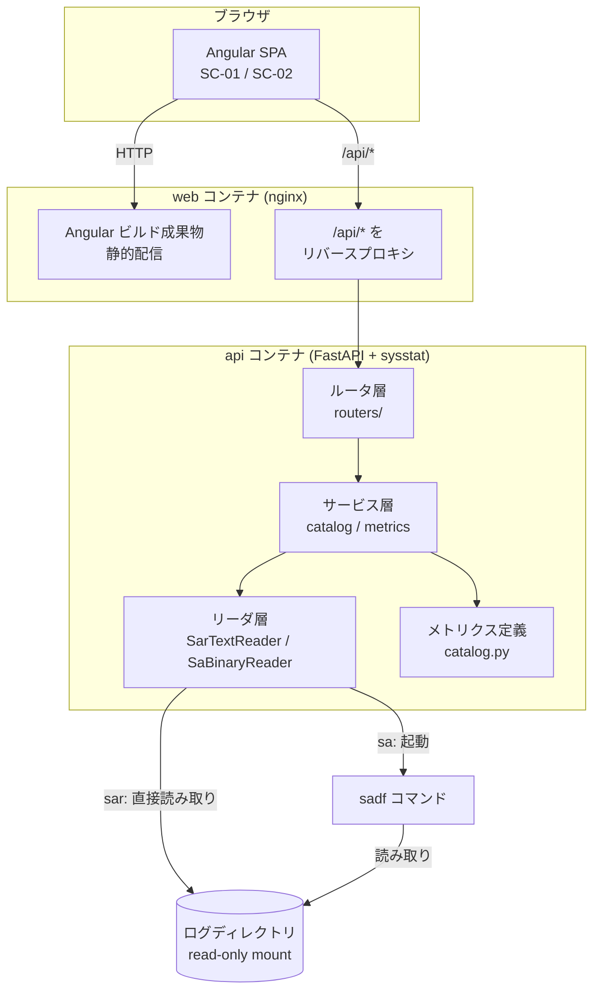
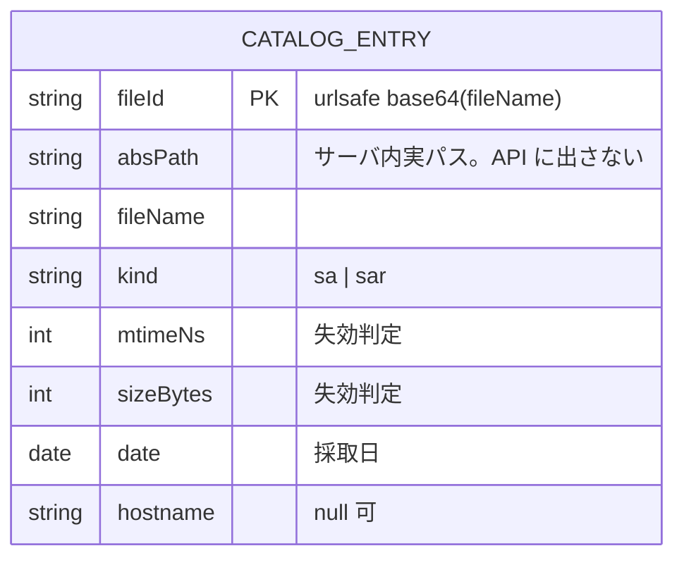
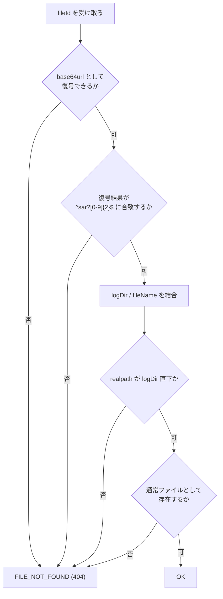
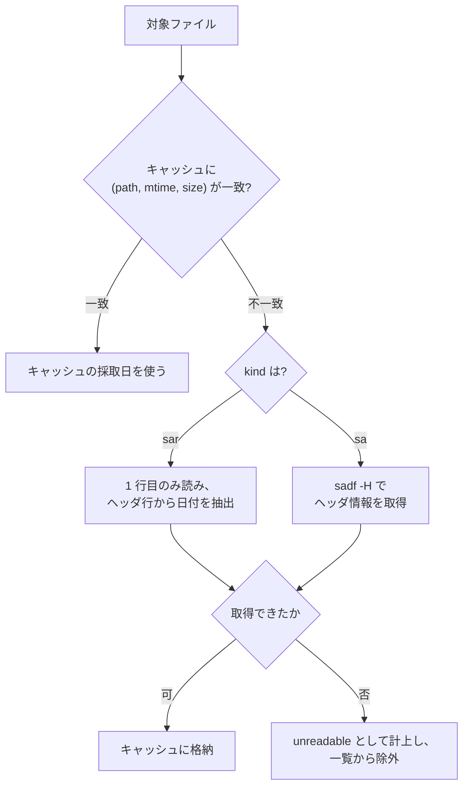
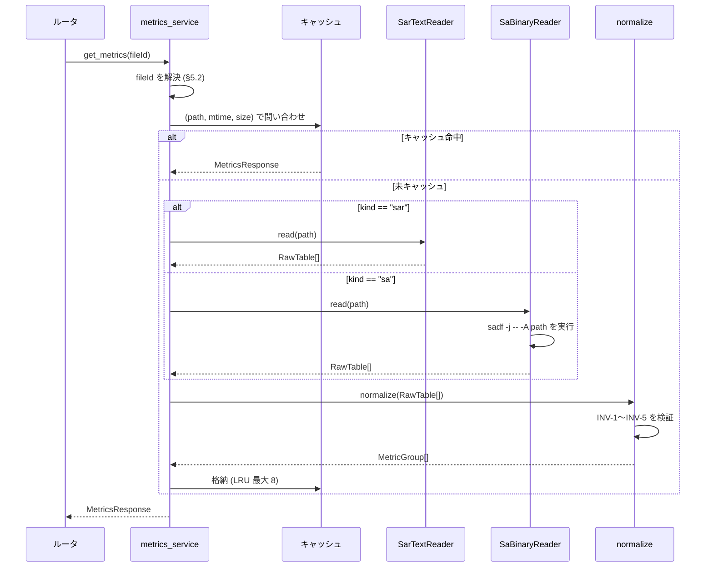
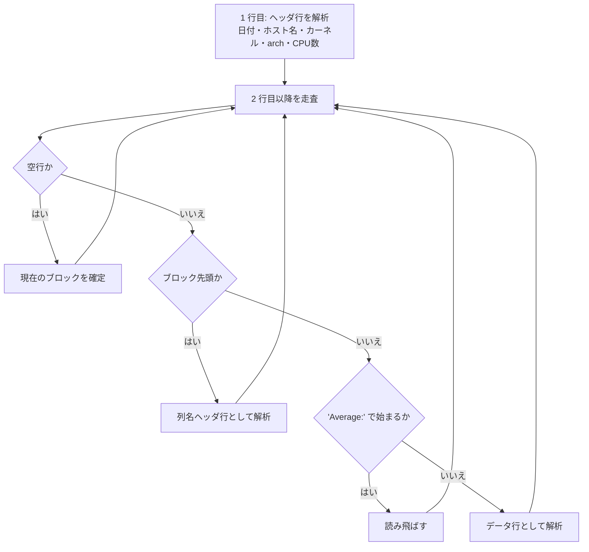

# P003 システム詳細設計書 — SysstatView

* 作成フェーズ: P003 (Plan Loop Step)
* 上位文書: `docs/P001-requirement.md`, `docs/P002-frontend-spec.md`

本書は P002 が定めた外部仕様を、どのように成立させるかを確定する。P001 に無い API をここで追加していない。

---

## 1. 全体構成

### 1.1 コンポーネント構成



### 1.2 レイヤと責務

| レイヤ | モジュール | 責務 |
| --- | --- | --- |
| ルータ | `routers/log_files.py`, `routers/catalog.py`, `routers/health.py` | HTTP の入出力、パラメータ検証、例外→エラー応答の変換 |
| サービス | `services/catalog_service.py` | ログディレクトリの走査、採取日の解決、キャッシュ、期間フィルタ、ページング |
| サービス | `services/metrics_service.py` | `fileId` の解決、リーダの選択、正規化結果の返却 |
| リーダ | `readers/sar_text.py` | `sar` テキストの解析 |
| リーダ | `readers/sa_binary.py` | `sadf` の起動と JSON の解釈 |
| 変換 | `readers/normalize.py` | 両リーダの出力を共通データ構造へ正規化 |
| 定義 | `metrics/catalog.py` | メトリクスグループ定義 (`GROUP_DEF` / `METRIC_DEF`) |
| 共通 | `errors.py` | ドメイン例外とエラーコードの定義 |

* **リーダ層は HTTP を知らない。** 例外はドメイン例外 (`errors.py`) を投げ、ルータ層が HTTP ステータスへ変換する。これにより両リーダを HTTP なしで単体テストできる。

---

## 2. クロスオリジン (CORS) の扱い

### 2.1 決定

**開発時・本番時ともに、フロントエンドと API を同一オリジンに見せる。CORS 設定 (`Access-Control-Allow-Origin` など) をアプリケーションに実装しない。**

| 環境 | 方式 |
| --- | --- |
| 開発 | Angular 開発サーバ (`ng serve`) の `proxy.conf.json` により、`/api/*` をバックエンド (`http://localhost:8000`) へ転送する |
| 本番 (docker compose) | `web` コンテナの nginx が Angular の静的ファイルを配信し、`/api/*` を `api` コンテナへリバースプロキシする |

### 2.2 選定理由

* 認証を持たないため Cookie の送受信要件が無く、CORS を許可する動機が弱い (P002 §5「認証は行わない」)。
* 同一オリジンに揃えれば、プリフライトリクエストの扱い・許可オリジンの環境別設定・本番で誤って `*` を許可する事故のいずれも発生しない。
* 開発と本番で同じ URL 構造 (`/api/...`) になり、フロントエンドに環境別のベース URL 設定が不要になる。

* この決定は **ADR-001** として `docs/ADR.md` に記録済み (P021 で確定。暫定番号「ADR-001見込み」から確定番号へ更新した)
* この決定は P008 (結合テスト定義)・P009 (受け入れ結合テスト定義) がテストハーネスを組む際の前提になる。テストは `web` 経由の同一オリジン構成、または API 単体への直接アクセスのいずれかで行い、CORS を前提にしたハーネスを組まない。

---

## 3. 状態の保持

| 状態 | スコープ | 実現方法 | 消失時の影響 |
| --- | --- | --- | --- |
| ファイルカタログ (`CATALOG_ENTRY`) | アプリケーション (プロセス単位) | **プロセス内メモリの辞書** | 次回の一覧取得時に再構築される。機能影響なし (応答が遅くなるのみ) |
| メトリクス解析結果 | アプリケーション (プロセス単位) | **プロセス内メモリの LRU キャッシュ** (最大 8 ファイル) | 再解析されるのみ。機能影響なし |
| SC-01 の画面状態 | ブラウザのメモリ | Angular のサービス (P002 §1.1) | リロード時に初期状態へ戻る (P002 で ★ACCEPTED★ 済み) |

* **永続化されたデータストアを持たない。** 外部の KVS・RDB を使わない。
* 複数ワーカーで起動した場合、キャッシュはワーカーごとに独立する。整合性の問題は生じない (キャッシュは読み取り専用ファイルの派生物であり、内容が一意に定まるため) ★ACCEPTED★ 検討したが採らなかった案: Redis などの共有キャッシュ。想定同時利用者 5 名 (REQ-N-012) に対して構成が過剰なため。残存リスク: ワーカー数に比例してメモリ使用量とキャッシュミスが増える。

### 3.1 キャッシュの失効判定

```python
# 疑似コード
key = (abs_path, stat.st_mtime_ns, stat.st_size)
# key が一致すればキャッシュを使い、変化していれば読み直す
```

* 時間ベースの有効期限を設けない。ファイルの `mtime` と `size` の両方が一致する限り内容は同一とみなす。
* 収集途中の当日ファイル (`sa24` など) は追記されるたびに `mtime` と `size` が変わるため、自動的に読み直される。

---

## 4. データモデルとスキーマ適用方式

### 4.1 スキーマ (マイグレーション) 方式

**本システムはリレーショナルデータベースを持たないため、スキーマ定義もマイグレーションも存在しない。** (P002 §6.1 で ★ACCEPTED★ 済み)

したがって次のとおりとする。

| 項目 | 内容 |
| --- | --- |
| 適用のタイミングと方式 | **該当なし。**マイグレーションを実行する処理を持たない |
| 冪等性 | **自明に冪等。**永続状態を持たないため、プロセスを何度起動しても初期状態は常に同一である |
| 冪等でない場合の担保 | 該当なし |

* 将来 CR によってデータストアを導入する場合は、その CR の P003 再入時に、バージョン管理テーブルによる差分適用方式を定めること。「全件再実行」方式は、後から `ALTER TABLE ... ADD COLUMN` が必要になった時点で破綻するため採用しない旨を、ここで先に決めておく。
* **アプリケーションを停止・再起動しても正常に起動することの確認**は、永続状態の有無にかかわらず必要である (キャッシュの再構築、`sadf` 検出の再実行が正しく行われることを含む)。この観点は単体テスト・スプリント内結合テスト (P007/P008) では代替できないため、**受け入れ結合テスト (P009) が担当する**。P006 (テスト計画) にこの観点を含めること。

### 4.2 内部データ構造

P002 §6.2 の論理エンティティを、Python の型として次のように表す。API 応答スキーマ (Pydantic モデル) と 1 対 1 に対応させる。

```python
# models.py (抜粋)
Kind = Literal["sa", "sar"]

class LogFileInfo(BaseModel):
    fileId: str
    fileName: str
    kind: Kind
    date: date
    sizeBytes: int
    hostname: str | None = None

class Series(BaseModel):
    key: str | None
    metric: str
    unit: str | None
    values: list[float | None]

class MetricGroup(BaseModel):
    groupId: str
    keyLabel: str | None
    timestamps: list[str]        # "YYYY-MM-DDTHH:mm:ss"
    series: list[Series]

class MetricsResponse(BaseModel):
    fileId: str
    fileName: str
    kind: Kind
    date: date
    hostname: str | None
    kernel: str | None
    arch: str | None
    cpuCount: int | None
    groups: list[MetricGroup]
```

#### 不変条件

両リーダの出力は、正規化層 (`readers/normalize.py`) を通した時点で次を満たさなければならない。

| # | 不変条件 | 違反時の扱い |
| --- | --- | --- |
| INV-1 | すべての `series[].values` の長さが、属する `MetricGroup.timestamps` の長さと一致する | `INTERNAL_ERROR` (500)。リーダの欠陥 |
| INV-2 | `timestamps` が昇順かつ重複なし | 同上 |
| INV-3 | `keyLabel` が `None` のグループの全 `series[].key` が `None` である | 同上 |
| INV-4 | `groupId` が `metrics/catalog.py` の定義に存在する | 同上 |
| INV-5 | `series` が空のグループは `groups` に含まれない | 同上 |

* 正規化層は上記を **assert ではなく明示的な検証** として実装し、違反時にドメイン例外を投げる。テストでの検出だけに頼らない。

### 4.3 ユーザインタフェースに現れないデータ

`CATALOG_ENTRY` の `absPath` のみがこれに該当する (P002 §6.3)。API 応答には一切含めない。



---

## 5. `fileId` の生成と解決

### 5.1 生成規則

```
fileId = base64url_encode(fileName)  # パディング "=" を除去
例: "sar23" → "c2FyMjM"
```

* **ファイル名のみを符号化し、ディレクトリパスを含めない。** ログファイルは単一ディレクトリ直下にあるものだけを対象とするため (§6.1)。

### 5.2 解決手順 (必ずこの順で検証する)



* 正規表現 `^sar?[0-9]{2}$` による検証を、パス結合**より前**に行う。これにより `../` や絶対パスを含む入力はパス操作に到達しない (REQ-N-007)。
* `realpath` による確認は、シンボリックリンクでディレクトリ外を指す場合への対処である。
* 失敗はすべて `FILE_NOT_FOUND` (404) に丸める。存在するファイルと存在しないファイルを応答から区別できないようにするため。

---

## 6. カタログサービス (`GET /api/log-files`)

### 6.1 ログディレクトリの走査

| 項目 | 内容 |
| --- | --- |
| 探索先 | 環境変数 `SYSSTAT_LOG_DIR` (既定値 `/var/log/sysstat`) |
| 探索範囲 | **直下のみ。サブディレクトリを再帰探索しない** |
| 対象とするファイル名 | 正規表現 `^sar?[0-9]{2}$` に合致するもの (P001 §3.3(c)) |
| 対象外 | ディレクトリ、シンボリックリンクの先がディレクトリ外を指すもの、上記に合致しない名前 |

### 6.2 採取日の解決



#### `sar` の採取日抽出

1 行目の形式は次のとおり (実データで確認済み)。

```
Linux 6.8.0-106-generic (www4250uj) \t2026-08-23 \t_x86_64_\t(3 CPU)
```

* 抽出は正規表現で行う。
  * 日付: `(\d{4}-\d{2}-\d{2})` — ISO 形式
  * ホスト名: `\(([^)]+)\)` の最初の一致
  * カーネル: 先頭の `Linux\s+(\S+)`
  * アーキテクチャ: `_([^_\s]+)_`
  * CPU 数: `\((\d+)\s+CPU\)`
* 日付が ISO 形式でない場合 (ロケール依存で `08/23/2026` や `2026年08月23日` になりうる) は、追加の書式を試行する ★FIXME★ (ISO 以外の実データを入手できていないため、対応書式は想定にとどまる)
* **ファイル全体を読まない。**先頭 1 行のみを読む (REQ-N-016)。

#### `sa` の採取日抽出

* `sadf -H <file>` を実行し、その出力からファイル日付を抽出する ★FIXME★ (この環境では `sadf` を導入できず実地確認ができていない。P102 実装時にコンテナ内で出力形式を確認し、必要なら本節を修正すること)
* `sadf` が存在しない場合は、その `sa` ファイルを `unreadable` として計上し一覧から除外する。**エラーにはしない** (REQ-N-015: `sar` のみで運用できること)。

### 6.3 フィルタ・ソート・ページング

処理順は次のとおり。

1. 走査した全エントリのうち、採取日が `from` 以上 `to` 以下のものを抽出する (両端を含む)。
2. ソートキー: `(date, kind の順序 [sa=0, sar=1], fileName)` の昇順 (P002 §2.3)。
3. `totalItems` = 抽出件数、`totalPages` = `ceil(totalItems / perPage)` (0 件のときは 0)。
4. `items` = ソート済み配列の `[(page-1)*perPage : page*perPage]` を切り出す。範囲外なら空配列。

### 6.4 パラメータ検証 (P002 §5.2 の規則をサーバ側でも実施)

| パラメータ | 検証 | 違反時 |
| --- | --- | --- |
| `from` / `to` | 必須。`YYYY-MM-DD` として解釈可能 | `INVALID_PARAMETER` (400) |
| `from` ≤ `to` | 相関検証 | `INVALID_PARAMETER` (400) |
| `page` | 整数、1 以上 | `INVALID_PARAMETER` (400) |
| `perPage` | 整数、1〜100 | `INVALID_PARAMETER` (400) |

---

## 7. メトリクスサービス (`GET /api/log-files/{fileId}/metrics`)

### 7.1 処理フロー



### 7.2 中間表現 `RawTable`

両リーダは、それぞれの入力形式を次の中間表現に変換する。**この時点では列名は元の表記のまま**であり、正規化層がメトリクスグループへ対応付ける。

```python
@dataclass
class RawRow:
    timestamp: str          # "YYYY-MM-DDTHH:mm:ss"
    key: str | None         # "all" / "vda" / "ens3" / None
    values: dict[str, float | None]   # 列名 -> 値

@dataclass
class RawTable:
    columns: list[str]      # 列名 (キー列を除く)
    key_label: str | None   # "CPU" / "DEV" / "IFACE" / "TTY" / None
    rows: list[RawRow]
```

* この中間表現を挟むことで、**2 経路の差異がリーダ層の内部に閉じ込められる** (REQ-F-024 を構造として保証する)。
* 中間表現は API に露出しない。

### 7.3 正規化 (`readers/normalize.py`)

1. `RawTable` の `columns` の集合から、対応する `groupId` を決定する (§9 の対応表)。
2. 同一 `groupId` の `RawTable` が複数ある場合 (`sar` のブロック分割に由来) は、`rows` を連結する。
3. `timestamps` = 全 `rows` の `timestamp` を昇順・重複排除して構築する。
4. 各 `(key, metric)` の組について、`timestamps` と同じ長さの `values` 配列を作る。該当するサンプルが無い添字は `None` を入れる。
5. INV-1〜INV-5 を検証する。
6. `metrics/catalog.py` の `displayOrder` で `groups` を並べる。

---

## 8. `sar` テキストリーダ (`readers/sar_text.py`)

### 8.1 解析アルゴリズム



### 8.2 実装上の要点 (実データで確認した事実にもとづく)

| # | 事実 | 実装への要求 |
| --- | --- | --- |
| 1 | **繰り返されるヘッダ行の直前には必ず空行が入る。** テストデータでは 11 サンプルごとにブロックが切り替わる | 空行の次の行は必ず「列名ヘッダ行」として扱う。行の内容から推測しない (REQ-F-027) |
| 2 | **同一の列構成を持つブロックが複数存在し、それらは 1 つのメトリクスグループを成す** | 空行を「セクションの終わり」と解釈してはならない。列構成が同じブロックは正規化層で連結する (REQ-F-027) |
| 3 | `Average:` で始まるブロックが各グループの末尾に置かれる。**このブロックも列名ヘッダ行を伴う** | 時刻列が `Average:` である行はデータ行として採用しない (REQ-F-028) |
| 4 | 列は空白揃えで固定幅ではない | `str.split()` (連続空白で分割) を用いる |
| 5 | キー付きグループはデータ行の 2 列目がキー | 列名ヘッダ行の 2 列目が `CPU` / `DEV` / `IFACE` / `TTY` のいずれかであればキー付きと判定する |
| 6 | 時刻表記はロケール依存 | `HH:MM:SS` と `HH:MM:SS AM/PM` の両方を受理する ★FIXME★ (AM/PM の実データ未入手) |
| 7 | データ行は日付を持たず時刻のみ | 1 行目から得た日付と結合する。**時刻が前の行より巻き戻った場合は日付を 1 日進める** (日をまたぐファイルへの備え) ★FIXME★ (テストデータは日をまたがないため未検証) |

### 8.3 列名ヘッダ行の判定

* 空行の直後の行を列名ヘッダ行とする (§8.2 #1)。
* 列名ヘッダ行の 1 列目は時刻またはリテラル `Average:` である。2 列目以降が列名。
* 2 列目が `CPU` / `DEV` / `IFACE` / `TTY` のいずれかならキー付き。その場合、`columns` は 3 列目以降になる。

### 8.4 数値の解釈

* `.` を小数点とする浮動小数点として解釈する。
* 解釈できない値 (`-` など) は `None` とする。**行ごと捨てない。**
* 数値列の個数が列名の個数と一致しない行は、破損行として読み飛ばし、警告ログに記録する。

---

## 9. `sa` バイナリリーダ (`readers/sa_binary.py`)

### 9.1 `sadf` の起動

| 項目 | 内容 |
| --- | --- |
| コマンド | `sadf -j -- -A <絶対パス>` |
| 起動方法 | `subprocess.run(argv_list, shell=False, ...)` — **シェルを介さない** (REQ-N-008) |
| 環境変数 | `LC_ALL=C` を設定し、ロケールによる出力差異を排除する |
| タイムアウト | 60 秒。超過時は `SADF_FAILED` ★FIXME★ (値は想定) |
| 標準出力の扱い | JSON として解釈する |
| 非 0 終了 | `SADF_FAILED` (502)。`stderr` を `error.detail` に載せる |
| コマンド不在 (`FileNotFoundError`) | `SADF_UNAVAILABLE` (503) |

* ユーザー入力は引数に連結しない。`<絶対パス>` は §5.2 の検証を通過したファイルのパスのみである。

### 9.2 `sadf -j` の出力構造

```json
{ "sysstat": { "hosts": [ {
  "nodename": "www4250uj", "sysname": "Linux", "release": "6.8.0-106-generic",
  "machine": "x86_64", "number-of-cpus": 3, "file-date": "2026-08-23",
  "statistics": [ {
    "timestamp": { "date": "2026-08-23", "time": "00:10:09", "interval": 600 },
    "cpu-load": [ { "cpu": "all", "user": 2.07, "nice": 0.02, "system": 0.75, ... } ],
    "memory": { "memfree": 123456, ... }
  } ] } ] } }
```

* `statistics[]` の各要素が 1 サンプル。その中のキーが統計種別、値が配列 (キー付き) またはオブジェクト (キーなし)。
* これを `RawTable` へ変換する。

> ★FIXME★ **本節の JSON フィールド名は sysstat の公開仕様にもとづく記述であり、本設計を行った環境では `sadf` を導入できなかったため実出力での確認ができていない。** P102 の実装時に、コンテナ内で `sadf -j -- -A` を実際に実行して出力を確認し、相違があれば §9.2・§9.3 を修正すること。この確認は P102 の完了条件に含める。

### 9.3 統計種別 → メトリクスグループ対応表

`sadf` の JSON キー、`sar` テキストの列構成、メトリクスグループ ID の対応を 1 箇所で定義する (P001 §7 の ★FIXME★ に対応)。

| groupId | `sar` テキストの識別列 | `sadf -j` のキー | キー列 |
| --- | --- | --- | --- |
| MG-CPU | `%usr` を含む | `cpu-load` | `cpu` |
| MG-PROC | `proc/s` を含む | `process-and-context-switch` | なし |
| MG-SWPIO | `pswpin/s` を含む | `swap-pages` | なし |
| MG-PAGE | `pgpgin/s` を含む | `paging` | なし |
| MG-IO | `tps` かつ `bread/s` を含む | `io` | なし |
| MG-MEM | `kbmemfree` を含む | `memory` | なし |
| MG-SWAP | `kbswpfree` を含む | `memory` (swap 系フィールド) | なし |
| MG-HUGE | `kbhugfree` を含む | `hugepages` | なし |
| MG-KTBL | `dentunusd` を含む | `kernel` | なし |
| MG-LOAD | `runq-sz` を含む | `queue` | なし |
| MG-TTY | 2 列目が `TTY` | `serial` | `line` |
| MG-DISK | 2 列目が `DEV` | `disk` | `disk-device` |
| MG-NET | 2 列目が `IFACE` かつ `rxpck/s` を含む | `network.net-dev` | `iface` |
| MG-NETERR | 2 列目が `IFACE` かつ `rxerr/s` を含む | `network.net-edev` | `iface` |
| MG-NFSC | `call/s` を含む | `network.net-nfs` | なし |
| MG-NFSD | `scall/s` を含む | `network.net-nfsd` | なし |
| MG-SOCK | `totsck` を含む | `network.net-sock` | なし |
| MG-SOFTNET | `squeezd/s` を含む | `network.net-softnet` | `cpu` |

* **`sar` 側の識別は「列名の集合に特定の列が含まれるか」で行う。** 列の並び順や個数に依存しない (sysstat のバージョンで列が増減しうるため)。
* `sadf` 側のフィールド名は `sar` 側の列名と異なる (例: `%usr` ↔ `user`)。**指標名は `sar` テキストの表記に揃える。** `metrics/catalog.py` の `METRIC_DEF` が正であり、`sadf` 側は対応表で読み替える。両経路の指標名が一致しないと REQ-F-024 を満たせないため。
* 上記対応表は `metrics/catalog.py` に単一の定義として置き、両リーダがこれを参照する。定義を 2 箇所に分けない。

---

## 10. メトリクス定義 (`metrics/catalog.py`)

* `GROUP_DEF` / `METRIC_DEF` は**コード内の定数**として定義する ★ACCEPTED★ 検討したが採らなかった案: YAML/JSON の外部ファイルに置く案。定義は起動時に決まり実行中に変わらず、型チェックと単体テストの対象にできるコード内定数のほうが安全であるため。残存リスク: 定義の変更に再ビルドが必要 (運用で頻繁に変わる性質のものではない)。
* `GROUP_DEF` は `groupId` / `title` / `description` / `keyLabel` / `displayOrder` を持つ。`displayOrder` は P001 §7 の並び順とする。
* `METRIC_DEF` は `name` / `groupId` / `unit` / `description` を持つ。
* 単位 (`unit`) の割り当て規則:

| 列名の形 | unit |
| --- | --- |
| `%` で始まる | `%` |
| `kb` で始まる | `KB` |
| `kB/s` で終わる | `KB/s` |
| `/s` で終わる | `/s` |
| `await` | `ms` |
| `ldavg-*` | `null` |
| 上記以外 | `null` |

* この規則は P002 §3.4 の「単位ごとにグラフを分割する」判断の入力になる。

---

## 11. エラー処理

### 11.1 ドメイン例外と HTTP の対応

```python
class AppError(Exception):
    code: str; http_status: int; message: str
    detail: str | None; hint: str | None
```

| 例外クラス | code | HTTP |
| --- | --- | --- |
| `InvalidParameterError` | `INVALID_PARAMETER` | 400 |
| `FileNotFoundAppError` | `FILE_NOT_FOUND` | 404 |
| `UnsupportedFileError` | `UNSUPPORTED_FILE` | 422 |
| `ParseFailedError` | `PARSE_FAILED` | 422 |
| `SadfUnavailableError` | `SADF_UNAVAILABLE` | 503 |
| `SadfFailedError` | `SADF_FAILED` | 502 |
| 上記以外の例外 | `INTERNAL_ERROR` | 500 |

* FastAPI の例外ハンドラを 1 箇所に登録し、P002 §5.1 の形式へ変換する。
* `INTERNAL_ERROR` の場合、`detail` に例外の文字列表現を含めない (内部情報の露出を避ける)。ログには完全なスタックトレースを記録する。

### 11.2 `sa` 読み取り失敗時の `hint` 生成

`SADF_UNAVAILABLE` / `SADF_FAILED` のとき、カタログサービスに**同一採取日の `sar` ファイル**が存在するかを問い合わせ、存在すればその名前を含む `hint` を生成する (P002 §5.3)。

```
"同一日の sar ファイル (sar23) が存在します。そちらを選択すると閲覧できます。"
```

* 存在しない場合は `hint` を `null` にする。

---

## 12. ログ出力

| 項目 | 内容 |
| --- | --- |
| 出力先 | 標準出力のみ (REQ-N-009)。ファイルに書かない |
| 形式 | 1 行 1 レコードの JSON |
| 必須フィールド | `ts` / `level` / `event` / `message` |
| リクエストログ | `method` / `path` / `status` / `durationMs` |
| `sadf` 実行ログ | `event: "sadf.exec"` / `argv` / `returncode` / `durationMs` |
| 読み取り失敗ログ | `event: "reader.failed"` / `fileName` / `reason` |

* ログ集約基盤への転送は行わない (P001 §10.5 で ★ACCEPTED★ 済み)。

---

## 13. インフラ寄りの非機能要件の担当フェーズ

次の項目は**アプリケーションコードの範囲を超える**ため、P003 ではアプリ側が前提とする内容のみを定め、実際の構成決定を後続フェーズへ委譲する。

| 非機能要件 | P003 でのアプリ側の前提 | 決定を委譲する先 |
| --- | --- | --- |
| TLS 終端 (REQ-N: P001 §10.3) | **アプリは平文 HTTP で待ち受ける。**TLS 終端は前段のリバースプロキシで行われる前提とする | **P302** (配布トポロジーと、社内ネットワーク外へ公開する場合の手順) |
| 可用性・再起動 (REQ-N-010) | アプリは永続状態を持たないため、プロセスの再起動で状態が壊れない。再起動ポリシーの設定はアプリ外 | **P005** (compose 定義のスプリント化) / **P302** (`restart: unless-stopped` の記述) |
| スケーラビリティ (REQ-N-012) | アプリはワーカー間で状態を共有しないため、ワーカー数を増やしても正しく動作する (§3) | **P005** (ワーカー数の既定値) / **P302** (実行コマンドの記述) |
| ログ集約基盤 (REQ-N-009) | アプリは標準出力に出すところまでを担う (§12) | **P302** (`docker compose logs` での参照手順) |
| ログディレクトリのマウント (REQ-N-006) | アプリは `SYSSTAT_LOG_DIR` を読み取り専用として扱い、書き込みを行わない | **P302** (compose の `volumes` に `:ro` を付ける) |
| sysstat の同梱 (REQ-N-011) | アプリは `sadf` が PATH 上にあることを期待するが、無くても `sar` 経路は動作する (§6.2) | **P005** (Dockerfile のスプリント化) / **P302** (イメージ定義) |

* P004・P010 は、これらの非機能要件の充足確認を上表の委譲先の記載にもとづいて判定する。

---

## 14. P002 のデータモデルに対する修正

**本フェーズで P002 のデータモデルを修正していない。** P002 §6 の論理エンティティをそのまま Python の型・中間表現へ写像しており、項目の追加・削除・意味の変更を行っていない。

---

## 15. P001・P002 に対する指摘事項

| # | 指摘内容 | 本書での扱い |
| --- | --- | --- |
| 1 | P001 §7 は `MG-SWAP` を独立グループとしているが、`sadf -j` では `memory` キーの中に swap 系フィールドが同居する可能性がある | §9.3 の対応表で「`memory` (swap 系フィールド)」として吸収する。実出力での確認は P102 に委ねる ★FIXME★ |
| 2 | P001・P002 は日をまたぐログファイルの存在を想定していない | §8.2 #7 で「時刻が巻き戻ったら日付を進める」と定めた。テストデータでは検証できない ★FIXME★ |
| 3 | P002 §5.2 は採取日を取得できないファイルを一覧から除外すると定めたが、利用者がその存在に気づく手段が `GET /api/health` のみである | 本バージョンではこの方針を維持する。UI 上の警告表示はスコープ拡張になるため行わない (指摘のみ) |
