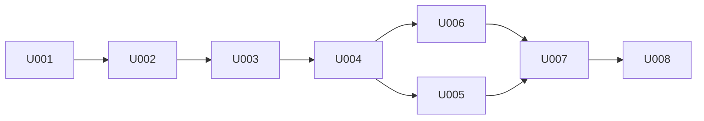

# P005 実装計画書 — SysstatView

* 作成フェーズ: P005 (Plan Loop Step)
* 上位文書: `docs/P001-requirement.md` / `docs/P002-frontend-spec.md` / `docs/P003-backend-spec.md` / `docs/P004-traceability-matrix.md`

---

## 1. 実装方針

### 1.1 スプリント分割の考え方

* **依存の向きに沿って下位レイヤから積む。** リーダ層 → サービス層 → API 層 → 画面層 の順とし、各スプリント完了時点でその層が単体テストで検証可能な状態になっていること。
* **`sar` 経路を `sa` 経路より先に実装する。** `sar` 経路はこの開発環境で実データによる完全な検証ができるのに対し、`sa` 経路は `sadf` を導入できず単体テストのフィクスチャに頼らざるを得ないため (§5)。先に検証可能な経路で正規化層と中間表現を固めておけば、`sa` 経路はその型に合わせるだけになる。
* **インフラ (コンテナ化) を最終スプリントに置く。** P003 §13 が P005 へ委譲したインフラ寄りの決定を、ここで独立したスプリントとして扱う。

### 1.2 技術スタックとバージョン

| 区分 | 採用 | バージョン | 備考 |
| --- | --- | --- | --- |
| バックエンド言語 | Python | 3.12 系 | コンテナは `python:3.12-slim` |
| バックエンドFW | FastAPI | 0.141 系 | Pydantic v2。開発環境で実際に検証したバージョンに固定した |
| ASGI サーバ | Uvicorn | 0.32 系 | ワーカー数の既定は 2 (P003 §13 の委譲事項) |
| バックエンドテスト | pytest / httpx | pytest 8 系 | `TestClient` で API を検証 |
| フロントエンド | Angular | **20 系** | スタンドアロンコンポーネント構成。当初 18 系を想定したが、この環境の Node v24.12.0 を Angular 18 がサポートしないため 20 系に変更した (Angular 22 は Node 24.15+ を要求し、これも満たせない) |
| グラフ描画 | Chart.js (直接利用) | Chart.js 4.5 系 | P002 §3.3 で採用確定。`ng2-charts` は Angular 22 以上を要求するため不採用 |
| フロントエンドテスト | Karma + Jasmine | Angular 標準 | ヘッドレス Chrome |
| 静的配信・プロキシ | nginx | `nginx:alpine` | P003 §2 の同一オリジン方針を実現 |
| sysstat | sysstat | ディストリ提供版 | `api` コンテナに同梱 (REQ-N-011) |

* 開発環境の実測: Python 3.14.2 / Node v24.12.0 が利用可能。**Docker は未インストール**であり、コンテナのビルド・起動はこの環境で検証できない (§5)。

### 1.3 ディレクトリ構成

```
SysstatView/
├── backend/
│   ├── app/
│   │   ├── main.py               # FastAPI アプリ生成・例外ハンドラ登録
│   │   ├── config.py             # SYSSTAT_LOG_DIR などの設定
│   │   ├── models.py             # Pydantic モデル (P003 §4.2)
│   │   ├── errors.py             # ドメイン例外 (P003 §11.1)
│   │   ├── logging_setup.py      # 構造化ログ (P003 §12)
│   │   ├── routers/
│   │   │   ├── health.py
│   │   │   ├── log_files.py
│   │   │   └── catalog.py
│   │   ├── services/
│   │   │   ├── catalog_service.py
│   │   │   └── metrics_service.py
│   │   ├── readers/
│   │   │   ├── raw.py            # RawTable / RawRow (P003 §7.2)
│   │   │   ├── sar_text.py
│   │   │   ├── sa_binary.py
│   │   │   └── normalize.py
│   │   └── metrics/
│   │       └── catalog.py        # GROUP_DEF / METRIC_DEF / 対応表
│   ├── tests/
│   │   ├── fixtures/             # sadf JSON フィクスチャ
│   │   └── test_*.py
│   ├── pyproject.toml
│   ├── requirements.txt
│   └── Dockerfile
├── frontend/
│   ├── src/app/
│   │   ├── core/                 # ApiService / SearchStateService
│   │   ├── pages/file-search/    # SC-01
│   │   ├── pages/graph-view/     # SC-02
│   │   └── models/
│   ├── proxy.conf.json
│   ├── nginx.conf
│   ├── package.json
│   └── Dockerfile
├── sysstat-log/                  # テストデータ (既存)
├── docs/
└── compose.yaml
```

---

## 2. スプリント一覧

| # | スプリント名 (英語) | 位置づけ | 依存 |
| --- | --- | --- | --- |
| U001 | `backend-foundation` | バックエンドの骨格。設定・モデル・例外・ログ・メトリクス定義・`/api/health` | なし |
| U002 | `sar-text-reader` | `sar` テキストの解析と正規化。**実データで完全に検証できる中核** | U001 |
| U003 | `sa-binary-reader` | `sadf` 起動と JSON 解釈。U002 が固めた中間表現に合わせる | U001, U002 |
| U004 | `catalog-api` | ログディレクトリ走査・採取日解決・キャッシュ・`GET /api/log-files` | U001, U002, U003 |
| U005 | `metrics-api` | `fileId` 解決・リーダ選択・`GET /api/log-files/{fileId}/metrics` / `GET /api/metric-catalog` | U001〜U004 |
| U006 | `frontend-foundation-sc01` | Angular 骨格・API クライアント・状態保持サービス・SC-01 | U004 |
| U007 | `frontend-graph-sc02` | SC-02 のグラフ描画・単位別分割・遅延描画・戻り時の状態復元 | U005, U006 |
| U008 | `containerization` | Dockerfile (api / web)・nginx 設定・compose 定義 | U001〜U007 |



---

## 3. 各スプリントの実装対象

### U001 `backend-foundation`

| 区分 | 実装対象 |
| --- | --- |
| API | `GET /api/health` (P002 §5.5)。ただし `readableFileCount` / `unreadableFileCount` は U004 完了までダミー値 0 を返し、U004 で接続する |
| データモデル | `LogFileInfo` / `Series` / `MetricGroup` / `MetricsResponse` / `LogFileListResponse` / `MetricCatalogResponse` / `ErrorResponse` (P003 §4.2) |
| データモデル | `GROUP_DEF` / `METRIC_DEF` / groupId 対応表 (P003 §9.3, §10) |
| その他 | `AppError` 階層と FastAPI 例外ハンドラ (P003 §11.1)、構造化ログ (P003 §12)、`SYSSTAT_LOG_DIR` 設定 (P003 §6.1) |
| 画面 | なし |

* **メトリクス定義 (18 グループ) をこのスプリントで完成させる。** 以降のすべてのスプリントが参照する単一の定義であるため、後回しにすると U002・U003 が独自の判定を持ち始める。

### U002 `sar-text-reader`

| 区分 | 実装対象 |
| --- | --- |
| API | なし |
| データモデル | `RawTable` / `RawRow` (P003 §7.2) |
| 処理 | `readers/sar_text.py`: 1 行目ヘッダ解析、ブロック分割、繰り返しヘッダの連結、`Average:` 除外、キー付き判定、数値解釈 (P003 §8) |
| 処理 | `readers/normalize.py`: `RawTable[]` → `MetricGroup[]`、INV-1〜INV-5 の検証 (P003 §7.3, §4.2) |

* 検証は `sysstat-log/var/log/sysstat/sar15`〜`sar23` の実データで行う。

### U003 `sa-binary-reader`

| 区分 | 実装対象 |
| --- | --- |
| API | なし |
| 処理 | `readers/sa_binary.py`: `sadf -j -- -A` の起動 (shell 不使用・`LC_ALL=C`・タイムアウト)、非 0 終了と不在の例外変換、JSON → `RawTable[]` 変換 (P003 §9) |
| 処理 | `sadf` の統計種別キー → `groupId` 対応、フィールド名 → `sar` 表記の指標名への読み替え (P003 §9.3) |

* U002 が確定させた `RawTable` に合わせる。正規化層は共通のものを再利用し、**このスプリントで新しい正規化ロジックを作らない** (REQ-F-024 を構造で担保するため)。

### U004 `catalog-api`

| 区分 | 実装対象 |
| --- | --- |
| API | `GET /api/log-files` (P002 §5.2) |
| API | `GET /api/health` の件数フィールドを実値に接続 |
| データモデル | `CATALOG_ENTRY` (P003 §4.3) |
| 処理 | ディレクトリ走査 (直下のみ・命名規則) 、採取日解決 (`sar` は 1 行目のみ / `sa` は `sadf -H`)、`(path, mtime, size)` によるキャッシュ、期間フィルタ・ソート・ページング、パラメータ検証 (P003 §6) |

### U005 `metrics-api`

| 区分 | 実装対象 |
| --- | --- |
| API | `GET /api/log-files/{fileId}/metrics` (P002 §5.3) |
| API | `GET /api/metric-catalog` (P002 §5.4) |
| 処理 | `fileId` の生成・解決 (base64url → 正規表現検証 → パス結合 → realpath 確認) (P003 §5) |
| 処理 | リーダ選択、LRU キャッシュ (最大 8)、`sa` 失敗時の `hint` 生成 (P003 §7.1, §11.2) |

### U006 `frontend-foundation-sc01`

| 区分 | 実装対象 |
| --- | --- |
| 画面 | SC-01 ログファイル検索・選択画面 (P002 §2) |
| その他 | Angular プロジェクト、ルーティング (`/`, `/graph/:fileId`)、`ApiService`、`SearchStateService` (P002 §1.1)、`proxy.conf.json` (P003 §2) |
| 実装項目 | 実行月の初期値算出、相関バリデーション、10 件ページング、`<前へ 1 2 次へ>`、初期選択=先頭行、0 件時表示 |

### U007 `frontend-graph-sc02`

| 区分 | 実装対象 |
| --- | --- |
| 画面 | SC-02 グラフ表示画面 (P002 §3) |
| 実装項目 | メトリクスカタログ取得、見出し・説明の表示、Chart.js による折れ線描画、**単位ごとのグラフ分割** (P002 §3.4)、遅延描画 (`IntersectionObserver`)、戻るボタンと状態復元 (P002 §4.1)、エラー時の `message` / `hint` 表示 |

### U008 `containerization`

インフラ・ミドルウェアを対象とするスプリント。P003 §13 が P005 へ委譲した事項をここで確定する。

| 区分 | 実装対象 | 委譲元 |
| --- | --- | --- |
| ミドルウェア | `backend/Dockerfile`: `python:3.12-slim` + **sysstat パッケージの導入** | REQ-N-011 / P003 §13 |
| ミドルウェア | `frontend/Dockerfile`: Angular ビルド → `nginx:alpine` へ成果物を配置 | P003 §2 |
| ミドルウェア | `frontend/nginx.conf`: 静的配信 + `/api/*` を `api:8000` へリバースプロキシ + SPA フォールバック | P003 §2 |
| 構成 | `compose.yaml`: `api` / `web` の 2 サービス、`restart: unless-stopped`、ログディレクトリの `:ro` マウント、`SYSSTAT_LOG_DIR` の指定 | REQ-N-006 / REQ-N-010 / P003 §13 |
| 構成 | Uvicorn のワーカー数 = **2** | REQ-N-012 / P003 §13 |

#### インフラ構成の決定内容 (P003 §13 の委譲を受けて確定)

| 項目 | 決定 |
| --- | --- |
| サービス構成 | `web` (nginx, 公開ポート 8080) と `api` (FastAPI, 内部ポート 8000) の 2 コンテナ。`api` はホストにポートを公開しない |
| TLS 終端 | **本構成では行わない。**社内ネットワーク内での利用を前提とする (P001 §10.3)。外部公開時は前段にリバースプロキシを置く手順を P302 に記載する |
| 再起動ポリシー | 両サービスとも `restart: unless-stopped` |
| ログ | 両サービスとも標準出力。`docker compose logs` で参照する (手順は P302) |
| ログディレクトリ | ホストの任意ディレクトリを `api` の `/var/log/sysstat` へ `:ro` でマウント。既定値は `./sysstat-log/var/log/sysstat` |
| ワーカー数 | Uvicorn `--workers 2` |

---

## 4. 全スプリント × 画面・API・データモデル 対応表 (実装漏れの検証)

### 4.1 画面

| 画面ID | 画面名 | 実装スプリント | 漏れ |
| --- | --- | --- | --- |
| SC-01 | ログファイル検索・選択画面 | U006 | なし |
| SC-02 | グラフ表示画面 | U007 | なし |

**P001 §4 の全 2 画面が割り当て済み。**

### 4.2 API

| メソッド・パス | 実装スプリント | 漏れ |
| --- | --- | --- |
| `GET /api/health` | U001 (骨格) / U004 (件数の実値) | なし |
| `GET /api/log-files` | U004 | なし |
| `GET /api/log-files/{fileId}/metrics` | U005 | なし |
| `GET /api/metric-catalog` | U005 | なし |

**P001 §9 の全 4 エンドポイントが割り当て済み。**

### 4.3 データモデル

| モデル | 定義元 | 実装スプリント | 漏れ |
| --- | --- | --- | --- |
| `LogFileInfo` | P002 §6.3 / P003 §4.2 | U001 | なし |
| `MetricGroup` / `Series` | P002 §6.3 / P003 §4.2 | U001 | なし |
| `MetricsResponse` | P003 §4.2 | U001 | なし |
| `ErrorResponse` | P002 §5.1 | U001 | なし |
| `GROUP_DEF` / `METRIC_DEF` | P002 §6.2 / P003 §10 | U001 | なし |
| groupId 対応表 (`sar` 列 / `sadf` キー) | P003 §9.3 | U001 | なし |
| `RawTable` / `RawRow` (中間表現) | P003 §7.2 | U002 | なし |
| `CATALOG_ENTRY` | P002 §6.3 / P003 §4.3 | U004 | なし |

**P002 §6 / P003 §4 の全モデルが割り当て済み。**

### 4.4 要求 ID × スプリント

| スプリント | 主に満たす要求 ID |
| --- | --- |
| U001 | REQ-N-002, REQ-N-009, REQ-N-013, REQ-F-018 (エラー形式) |
| U002 | REQ-F-022, REQ-F-027, REQ-F-028, REQ-F-029, REQ-F-024 (正規化) |
| U003 | REQ-F-001, REQ-F-016, REQ-F-023, REQ-N-008, REQ-F-024 |
| U004 | REQ-F-002, REQ-F-005, REQ-F-007, REQ-F-015, REQ-F-017, REQ-F-020, REQ-F-021, REQ-F-025, REQ-F-026, REQ-N-003, REQ-N-015, REQ-N-016 |
| U005 | REQ-F-012, REQ-F-013, REQ-F-019, REQ-N-004, REQ-N-007 |
| U006 | REQ-F-003, REQ-F-004, REQ-F-006, REQ-F-008, REQ-F-009, REQ-F-010, REQ-N-001 |
| U007 | REQ-F-011, REQ-F-013, REQ-F-014, REQ-F-018 (画面表示), REQ-N-005 |
| U008 | REQ-N-006, REQ-N-010, REQ-N-011, REQ-N-012 |
| (テスト計画) | REQ-N-014 → P006 / P009 が担当 |

**REQ-F-001〜029、REQ-N-001〜016 のすべてがいずれかのスプリントまたはテストフェーズに割り当て済み。**

---

## 5. 実行環境の制約 (実装に先立って確認した事実)

本計画を立てるにあたり開発環境を実測し、次を確認した。**これらは想定ではなく実測値である。**

| 項目 | 状態 | 実装への影響 |
| --- | --- | --- |
| Python 3.14.2 | 利用可 | バックエンドの実装・単体テストを実行できる |
| Node v24.12.0 / npm 11.7.0 | 利用可 | フロントエンドの実装・単体テストを実行できる |
| **Docker / docker compose** | **未インストール** | U008 の成果物を**この環境ではビルド・起動できない**。記述の正しさはレビューで担保し、実行確認は行えない |
| **`sadf` (Windows 側)** | **無し** | `sa` 経路をネイティブに実行できない |
| **`sadf` (WSL Ubuntu 側)** | **未導入**。apt に候補あり (12.5.2) だが `sudo` がパスワードを要求するため非対話で導入できない | `sa` 経路の実データ検証を行えない |

### 5.1 制約への対処方針

* **`sar` 経路 (U002)**: 実データ (`sar15`〜`sar23`) で完全に検証する。本アプリの中核ロジックであり、ここは妥協しない。
* **`sa` 経路 (U003)**: `sadf -j` の出力を模したフィクスチャ JSON による単体テストで検証する。**「実際の `sadf` 出力で動作確認した」とは記載しない。**
* P003 §9.2 に付した ★FIXME★ (JSON フィールド名が未確認) は、この制約に由来する。**`sadf` が利用可能な環境で最初に実行する際に、出力形式を確認して P003 §9.2・§9.3 を修正する必要がある。**
* **U008 (コンテナ化)**: 定義ファイルを作成するが、この環境ではビルド・起動を確認できない。P302 の配布手順に、利用者が最初に行うべき確認手順として明記する。
* 上記の制約は P022 (ArchitectureHandbook) の「既知の制約・技術的負債」に記録し、後続の Executor へ引き継ぐ。

★ACCEPTED★ 検討したが採らなかった案: `sadf` を導入できないため `sa` 経路の実装自体を後回しにする案。`require.txt` が第一に求めているのは `sa` ファイルの読み取りであり、検証手段が限られることを理由にスコープから外すのは要求に反するため採らなかった。残存リスク: `sa` 経路は `sadf` が利用可能な環境での初回実行時に、フィールド名の不一致による修正が必要になる可能性が高い。この修正を最小の範囲に閉じ込めるため、対応表を `metrics/catalog.py` の 1 箇所に集約する設計としている (P003 §9.3)。
