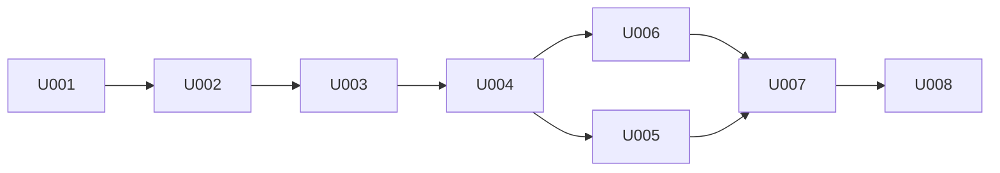

# P007 プログラム実装定義 兼 プログラミング指示書 — 目次 (OKF形式)

* 作成フェーズ: P007 (Plan Loop Step)
* 上位文書: `docs/P002-frontend-spec.md` / `docs/P003-backend-spec.md` / `docs/P005-impl-plan.md` / `docs/P006-test-plan.md`

## 目次

* 状態は `[ ]`(未着手) / `[~]`(進行中) / `[x]`(完了) の3種類。
* 1項目 = 1スプリント。スプリント内部のタスク単位の進捗は、各スプリントファイル内の「タスク一覧(OKF副目次)」で管理する。
* 全項目が `[x]` になって初めて本フェーズを完了とみなす。これは Plan Loop Step の完了条件とは別の、実行結果にもとづく基準である。

- [x] U001 [backend-foundation](./P007-impl-direction/U001-backend-foundation.md) — 設定・モデル・例外・ログ・メトリクス定義・health の骨格
- [x] U002 [sar-text-reader](./P007-impl-direction/U002-sar-text-reader.md) — `sar` テキスト解析と共通正規化 (本システムの中核)
- [x] U003 [sa-binary-reader](./P007-impl-direction/U003-sa-binary-reader.md) — `sadf` 起動と JSON → 中間表現の変換
- [x] U004 [catalog-api](./P007-impl-direction/U004-catalog-api.md) — ディレクトリ走査・採取日解決・キャッシュ・`GET /api/log-files`
- [x] U005 [metrics-api](./P007-impl-direction/U005-metrics-api.md) — `fileId` 解決・リーダ選択・メトリクス取得 API
- [x] U006 [frontend-foundation-sc01](./P007-impl-direction/U006-frontend-foundation-sc01.md) — Angular 骨格・状態保持・SC-01
- [x] U007 [frontend-graph-sc02](./P007-impl-direction/U007-frontend-graph-sc02.md) — SC-02 グラフ描画・単位別分割・状態復元
- [x] U008 [containerization](./P007-impl-direction/U008-containerization.md) — Dockerfile・nginx・compose

## スプリント間の依存

## 全スプリント共通の実装規約

| 項目 | 規約 |
| --- | --- |
| Python | 3.12 互換の構文。型注釈を付ける。`from __future__ import annotations` は使わない |
| 命名 | API 応答のフィールドは **camelCase** (P002 の定義どおり)。Python 内部の変数・関数は snake_case |
| Pydantic | v2 の `BaseModel`。応答モデルのフィールド名は camelCase で直接定義する (alias を使わない) |
| 例外 | リーダ層・サービス層は `errors.py` のドメイン例外のみを投げる。`HTTPException` を投げない |
| ログ | `print` を使わない。`logging_setup.py` が構成したロガーを使う |
| テスト | 1 テスト 1 観点。テスト名は検証内容が読み取れる名前にする |
| 実データ | `sysstat-log/var/log/sysstat/` を書き換えない。書き込みを伴うテストは `tmp_path` にコピーする |
| 先行実装 | 自スプリント・自タスクの範囲外のファイルを作らない・編集しない |
